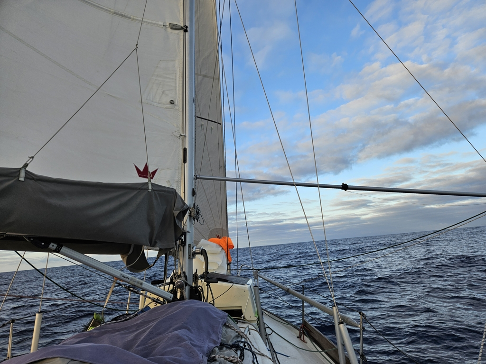

In the night we saw a light without a corresponding dot in the plotter. A boat without AIS so far offshore, that is something we haven't seen on this trip. After about an hour the light was identified as a green position light, so a sailboat then. Few hours after that we passed the sailboat from the bow and could further deduce that the light we see is most likely a mast top tricolor, so we could see it from afar.

As the dawn broke and the sails could be spotted in the distance with binoculars we could confirm our night time deductions. We are seemingly both heading to Porto Santo, so an open ocean regatta is under way! We seem to be losing though as the other boat keeps getting nearer. From light, to sails to also occasionally seeing the hull.

 

Lille Ø is contently bringing us forward and our rhythm at sea has found its groove. Days have lost their meaning and the watches are what matters. One day watch for handcrafts and a night one for listening podcasts and books.

* Distance today: 101NM
* Total distance: 3821.3NM
* Dinner: feta salad
* Engine hours: 1.8
