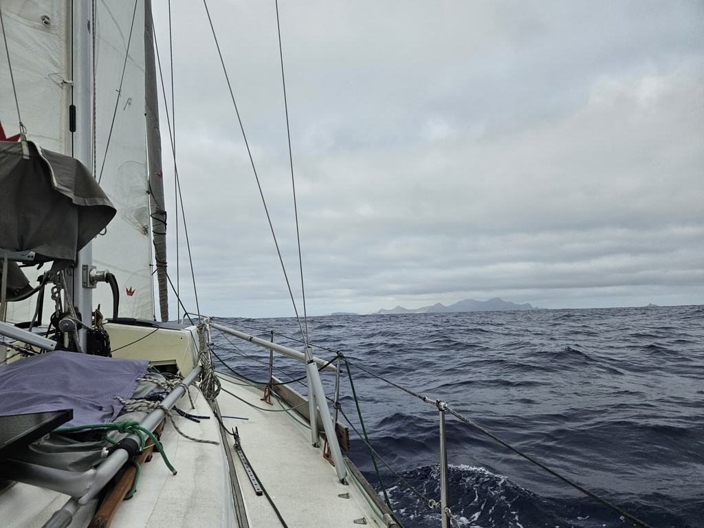
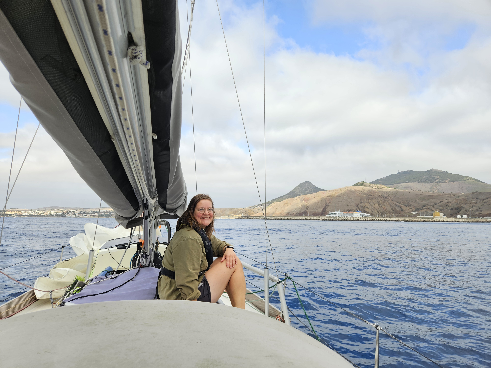
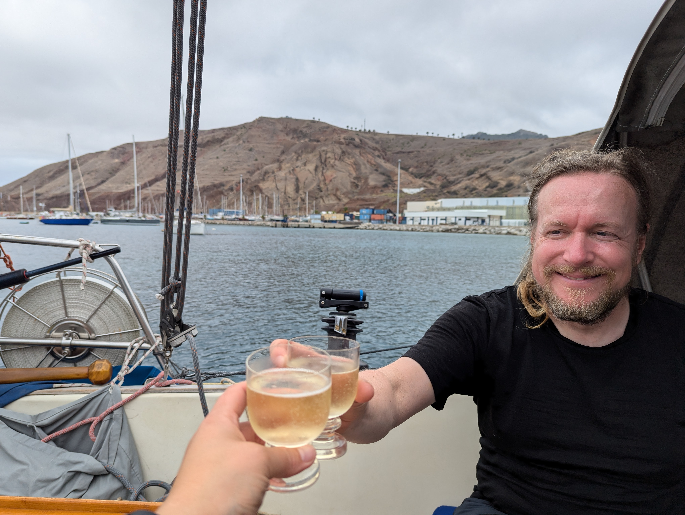

We again set up the poled out headsail for the night watches in order to be able to get further downwind and towards our target. Just an hour later, a 22kt gust came through the whisker pole buckled with a "snap". We scrambled to roll the genoa in and to lash down the broken pole. Oops. Thankfully we carry a spare.

We carried on through the blustery night with just the full main and staysail. The night was quite humid, and so the light on Ilheu de Cima became visible only at around 20NM distance, shortly before sunrise.

 

With the brightening day, the mountainous island of Porto Santo itself appeared from under the horizon and the mist. Very different landscape than what we're used to!

 

The marina didn't answer on VHF. But as we had a contact to some sailors that had arrived earlier, we were able to learn that the marina and the moorings were all fully packed. So options were either the very tight anchorage inside the wavebreak, or the more spacious and scenic but very rolly anchorage outside.

This was another moment to be happy having a full-keel boat with a relatively shallow draft. We were able to squeeze ourselves to the far corner of the protected anchorage. This was made somewhat more exciting by the fact that our depth sounder wasn't working. So we went old-school, scoping out the swing radius slowly and carefully with a lead line.

By now the depth sounder is already fixed, and it is time for some bubbly to celebrate the completion of this ocean passage. Tomorrow we can start exploring the island.

 

* Distance today: 78NM
