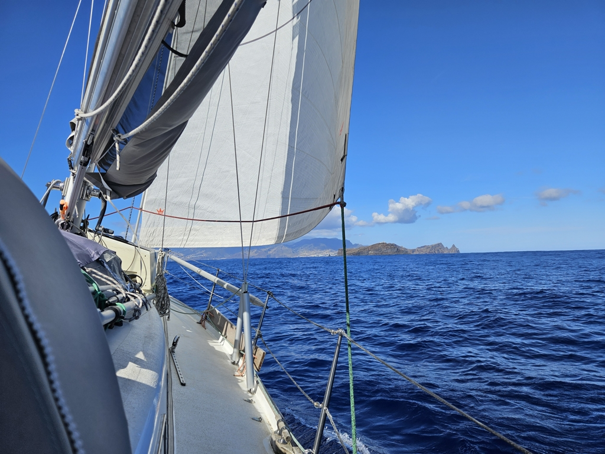
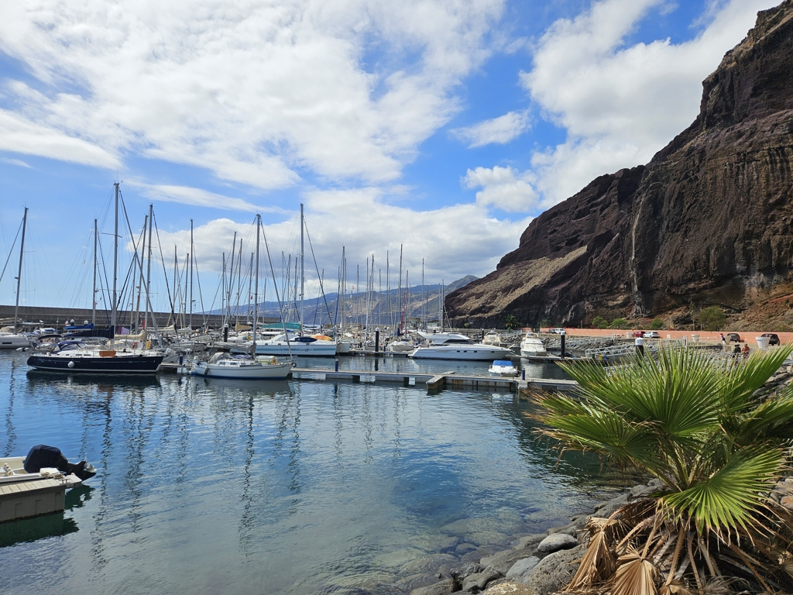

Now that we are out of the orca area, sailing can yet again be decided upon best winds. So the alarm rang at 3:30 and at 4am we hoisted the anchor and motored into the darkness. 

As we got out of the wind shadow of Porto Santo, we enjoyed a steady 10 kn wind on the beam. The swell was big but far apart, so the sails weren't flapping too bad.. though our optimising lead us to figure out a new way of attaching the lee side main sheet. By removing it from it's usual place in the cockpit coaming and setting it up at the genoa track, where we have an extra attachment point. Now the boom was secure against the swell and we got a knot of more speed as the moving boom was spilling wind out of the sail. We absolutely love the versatility of the double main sheet!

 

As the dawn broke, wind became more variable in strength and direction. As we came closer to wind shadow of Madeira, we tacked and motored a bit. Now we are securely tied in to the pier in the marina waiting for the gale to come over the weekend. Getting a spot here required help from a German sailing couple we met in Viana do Castelo. Already many larger boats have been turned away, but a small Lille Ø fitted right in!

 

* Distance today: 33NM
* Total distance: 3932.3NM
* Engine hours: 2.1
