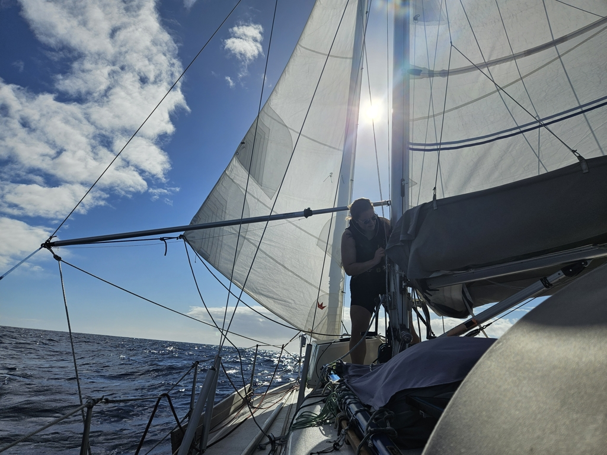
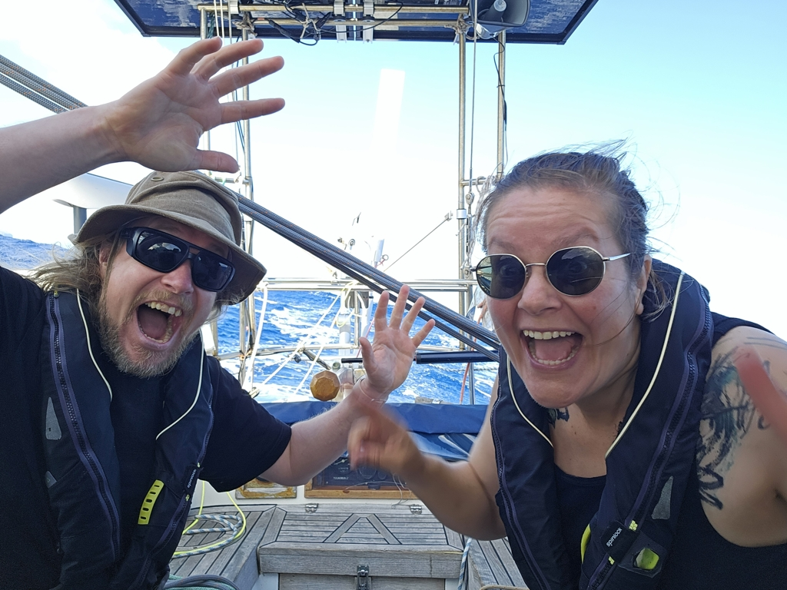

Much of the last week was spent sheltering from the tails of old hurricane remnants that were making their march east towards Biscay or Portugal. The nice Madeira season was clearly coming to a close.

And so, in the morning we prepared the boat for offshore, turned it around with ropes on the pier, and then left the marina.

 

In the wind acceleration zone behind the island of Madeira the conditions were quite blustery, gusting up to 30kt. So we first hoisted the staysail and a double-reefed main.
Then we've been progressively increasing sail, as the winds have been getting lighter.

 

* Distance today: 41NM
* Lunch: feta salad
