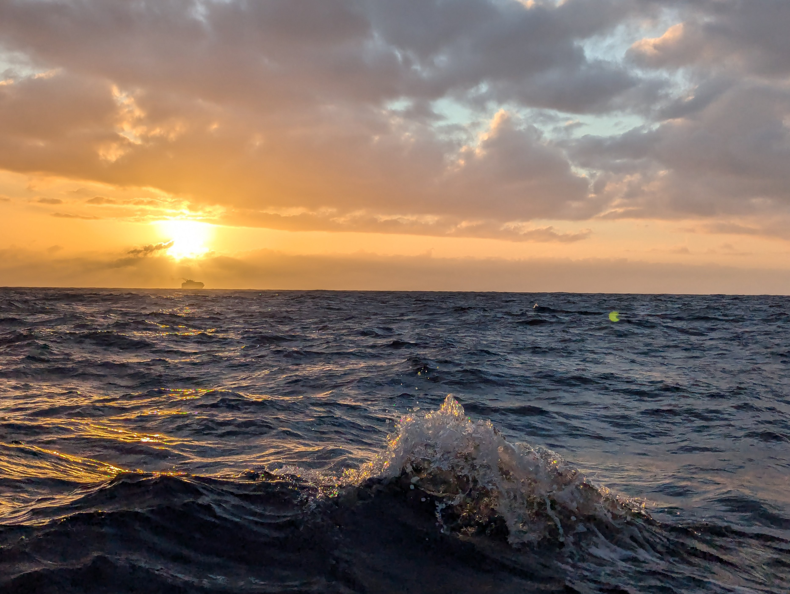

In the evening sky we could enjoy the comet making its pass. The moon was up, so the darkness didn't set in properly, what a joyous feeling.

As the night drew on, the wind dwindled down to 4 knots. That was the moment to switch from sail power to engine. Weather forecast from Tuesday morning had us sailing the whole way. We got new weather on Wednesday morning and there was an update.

 

No wind till Wednesday evening, what a bummer. Now we are still motoring and hoping that the wind will pick up soon so we can yet again glide into the night in silence.

* Distance today: 98NM
* Total distance: 4071.3NM
* Lunch: mushroom and tomato börek
* Engine hours: 12.1
