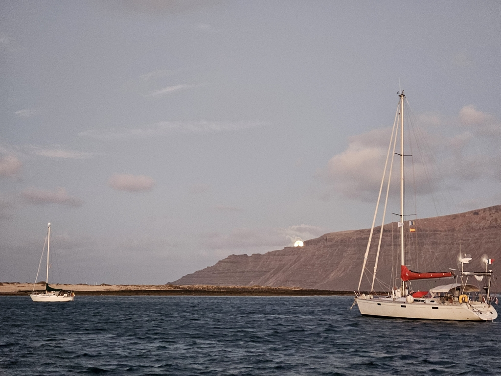

Right after dinner the wind picked up, and we could finally sail again. First on a tentative wing-on-wing, and soon we put in the first reef and moved the staysail to the same side.

What followed was a fun fast 24h of sailing on a beam reach. Wind vane steered, and despite the large waves hitting us on the beam, the boat moved like on rails.

The cloudy night didn't give many stargazing opportunities. But the full moon gave everything this quite surreal look, like the boat and the sea had stage lighting. Realisation hits: at 29°N we're now closer to the Equator than to Shetlands.

 

Land was sighted in the beginning of the first afternoon watch. The first islands of the Canaries rose from the horizon. We reached La Graciosa in the evening, and dropped anchor to a bay between it and Lanzarote just as the sun set.

 

Now time for that well-deserved anleger. Kippis, Martina!

* Distance today: 136NM
* Total distance: 4207.3NM
* Engine hours: 0.4
