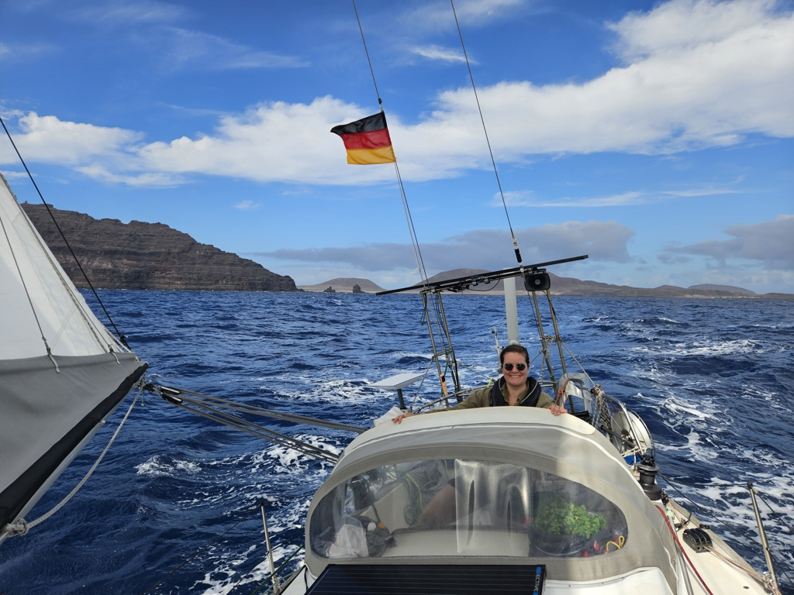

After few days in anchor and ten after the latest grocery run, it was time to move. We motored against the wind and current between La Graciosa and Lanzarote and hoisted main and reefed genoa when we could turn to first a beam reach and later to wing on wing.

 

The large swell, small current and nice 15 to 20 kn of wind pushed us fast towards Arrecife. Marina Lanzarote doesn't take any reservations during the high season (September to December). So when we were 1 mile out from the wave break, Bergie radioed in and we got our spot assigned. Arrecife harbour has a good map of the place allocation on their website, so we had the luxury of knowing which side to prepare and exactly where we were going. Something that is surprisingly rare. 

 

Well stay here for a week at least and do some boat projects, sightseeing and hanging out with our Finnish friends we met in Viana do Castelo.

* Distance today: 27.1NM
* Total distance: 4234.4NM
* Lunch: lentil coconut curry
* Engine hours: 2.1
