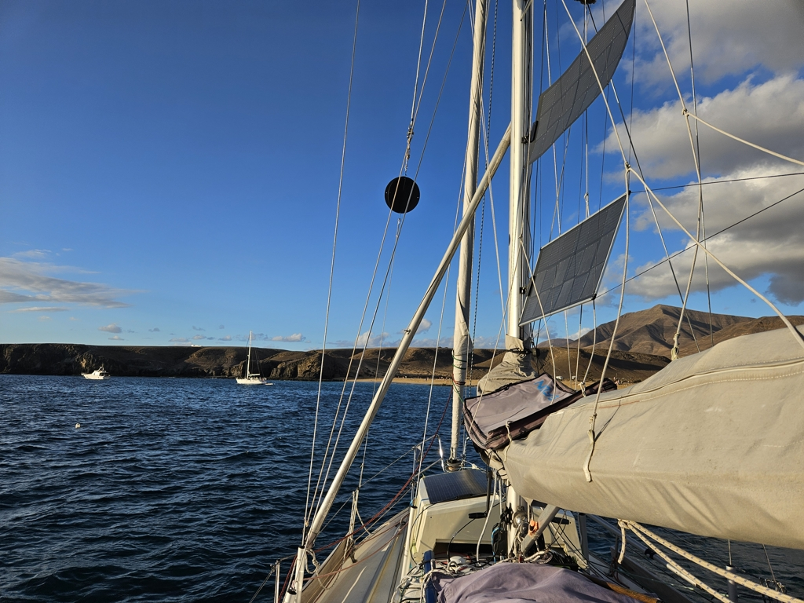

A week went by quickly on Lanzarote, getting to know the volcanic landscape and hanging out with some fellow cruisers. But now forecast has a week of calm ahead, and so we thought it would be more fun to spend that in an anchorage. 

With some careful boathook work, we were able to back the boat to the opposing box, and then motor out of the really narrow corner where the marina had placed us. We stopped by the fuel dock, as the last fill-up on Isle of Man has been a while ago. To our surprise, our (officially) 80l tank could fit 104l of diesel.

Then sails up and south, following the eastern coast of Lanzarote. Desert landscape, some resorts, and a few sailboats. The Spanish coastguard also gave us a short-distance drive-by.

 

We had to motor the last hour as the wind died, but now we're tucked in the bay behind Cape Papagayo, in front of a series of scenic beaches. If weather is as forecasted, we'll likely spend the next week here, hanging out and snorkeling.

 

* Distance today: 17.9NM
* Total distance: 4252.3NM
* Dinner: feta salad
* Engine hours: 1.9
