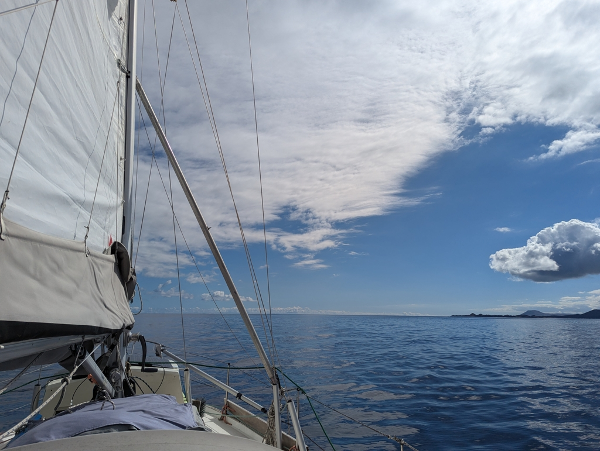
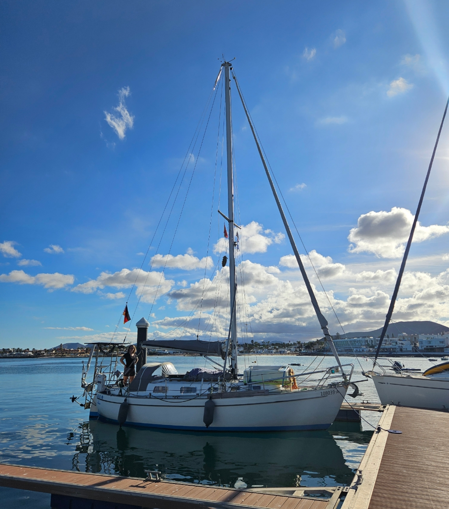

The days in anchor proved to be a bit more stressful than anticipated. Our anchor trip buoy attracted multiples of rental motorboats trying to use it as a mooring ball. Two of them managed to tie themselves to our thin line and drag our anchor... After the second incident when we had to reposition the anchor, we decided to remove the marking buoy completely. Apparently the rental places tell the boats that there are free moorings in the anchorage, but they don't tell the boats not to tie next to other vessels or how to make sure you are on an actual mooring and not on someone's anchor marker...

Our friends from London had arrived to Fuerteventura, so we hoisted the anchor in the morning and enjoyed a lazy sailing day towards south. The multi-day calm had calmed the sea to a smooth state. Even the 3 to 5 kn wind was enough to push us along. Just like the lazy summer days in Havel, thought we had way less of traffic to pay attention to.

 

At the wave break we finally could hear the marina on channel 9 and were advised to go to the second pontoon. There is a lot of empty boxes here. This is a municipal dock, so no showers or toilets on land, but as soon as our registration for the app goes through, we have access to electricity and water.

 

* Distance today: 8.4NM
* Total distance: 4260.7NM
* Lunch: gazpacho 
* Engine hours: 1
