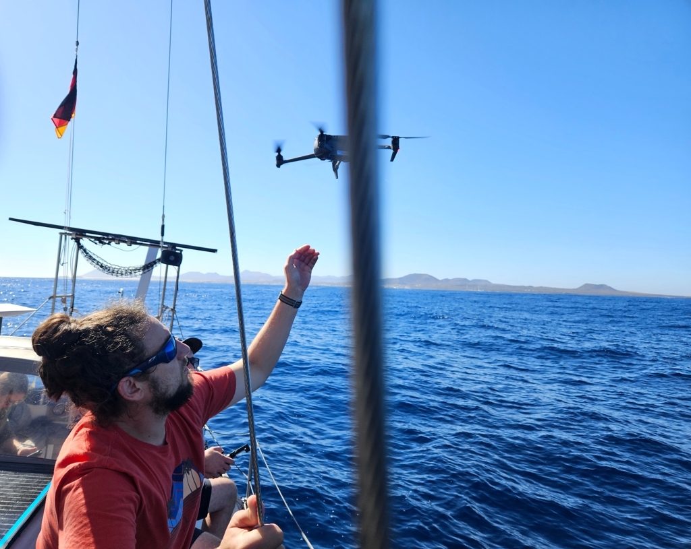

Tropical storm Patty has sort of messed up the whole Atlantic weather system, and so on the "Island of Strong Winds" we've had a calm for a week.

Today finally the forecast had some hope, and so we took our friends sailing. In the morning the wind wasn't quite strong enough for the swell, and so we motorsailed to Lanzarote. Anchor down, swim break, and a lunch.

 

Then in the afternoon the wind filled in, and we had quite the perfect sunny sail back to Fuerteventura. Main on the first reef and staysail.

 

* Distance today: 16.1NM
* Total distance: 4276.8NM
* Lunch: Couscous salad
* Engine hours: 2.2
