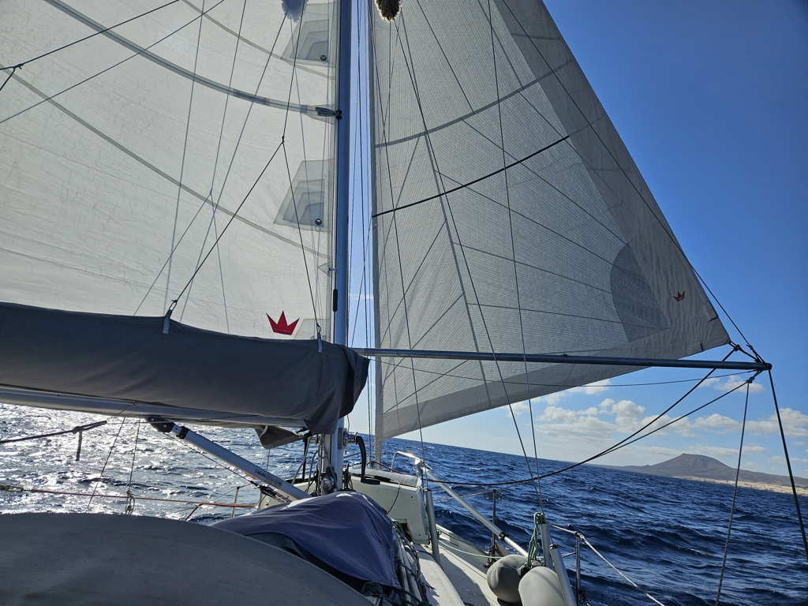

The morning started with trying to find the harbour master for paying the twi extra days we had spent trying to ship a DHL parcel out of Fuerteventura. Apparently the fact that the harbour in Corralejo has no street number was a hurdle too high for the service. Sigh.

After we had paid the extra days we were off. We hoisted the full sails just outside the wave break and were on our way! As soon as we were past the shallows, we turned into a comfortable wing on wing in the small residual swell. 

 

Today we tried fishing again and caught our first tuna! It was made into a delicious lunch. I just love that our simplest fishing system, line and octopus lure with hooks works so well.

After lunch we got our sailing workout. The winds were variable, so we kept switching between full genoa and reefed genoa. And gybing. And motoring. And furling and unfurling. Until we started getting a bit of a time pressure to arrive before darkness. So we motored the last 4 miles and found a free spot in the harbour. 

To our delight there was a Finnish boat in here already, so we spent a lovely evening on their boat talking about our adventures so far.

* Distance today: 40.1NM
* Total distance: 4316.9NM
* Lunch: fresh tuna with garlic soy sauce
* Engine hours: 1.5
