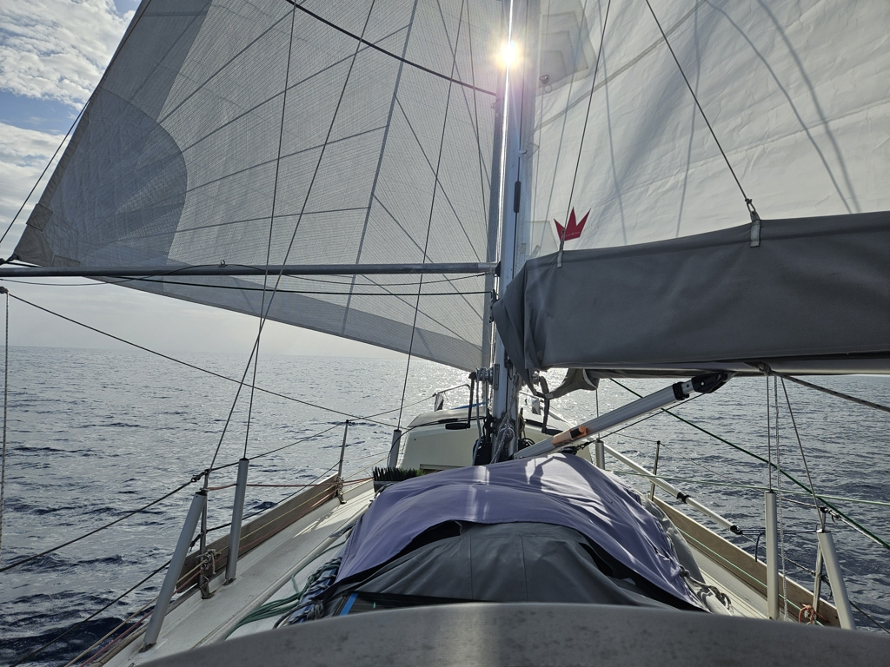
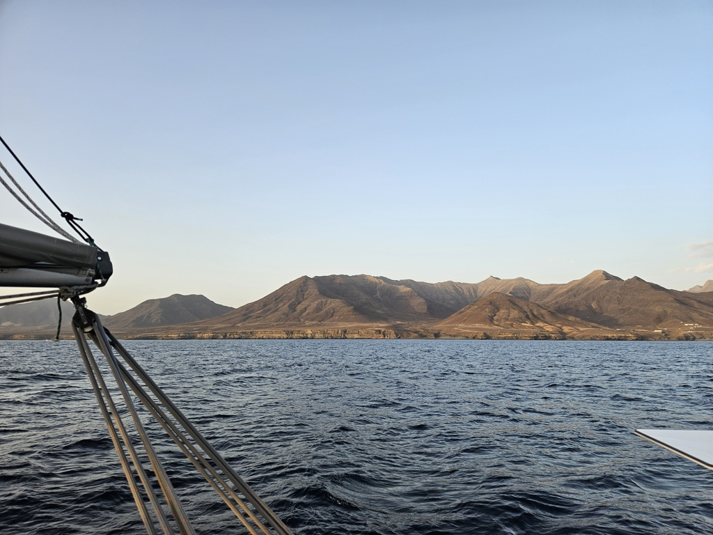

The stop at Gran Tarajal ended up being a bit longer. At first there was no wind, then strong winds but from totally wrong direction. And then finally a nice forecast that allowed us to leave just before noon.

We left the marina wing on wing on a port tack. At some point the winds died a bit, and we had to point higher. But then at Punta del Morro Jable, winds picked up again and we could follow the coast west.

 

Just before lunch we were approached by a big pod of dolphins accompanied by a couple of really big pilot whales. They didn't stay for long, but were clearly curious about us.

Sailing has been easy with almost flat seas and quite light winds, and so we've spent the day trying to recommission our watermaker. So far the results are not promising, but we keep trying various tricks.

 

Now we have the bow pointed towards Gran Canaria, as we head into night watches.

* Distance today: 27.5NM
* Total distance: 4344.4NM
* Lunch: spaghetti with avocado sauce 
* Engine hours: 0.2
