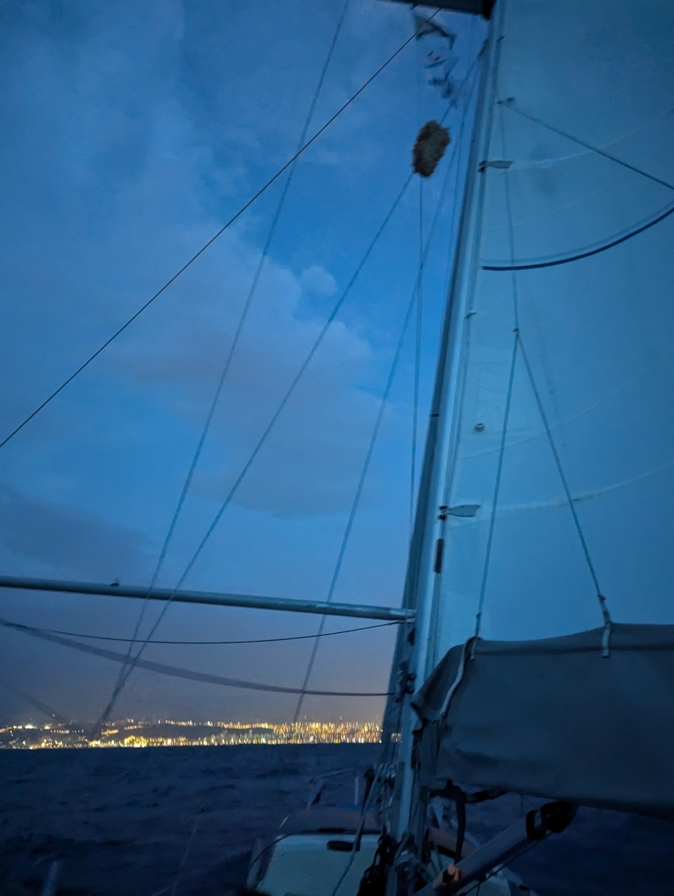
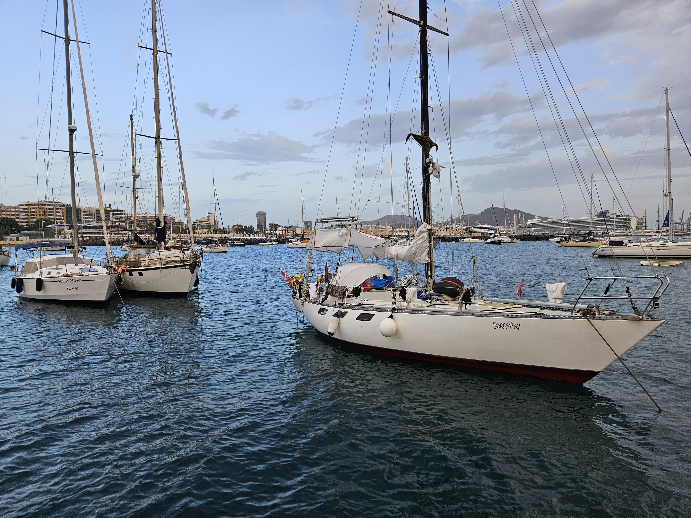

The night fell under partially cloudy sky. Untill the moon rose, it was very dark. The wind was variable, like it couldn't decide which direction or speed to take. We passed the traffic separation scheme without issues.

 

In the morning as we got closer to Las Palmas we kept rolling in the genoa and finally putting in a first reef to the main sail, partially because there was a thunder cloud near us, but also to slow us down not to arrive in the darkness.

The marina in Las Palmas is absolutely full with the ARC boats, and so the harbour anchorage has been extended a lot. Despite that, in the inner anchorage boats were packed like sardines. Quite dangerous, if there should be a gust. We elected for the more spacious but rolly outer anchorage. 

 

Now it's time to get some sleep, go check in at the marina office and visit the local chandlery. The wind direction is anything but optimal, but we are hiding behind a small wave break.

* Distance today: 55.5NM
* Total distance: 4399.9NM
