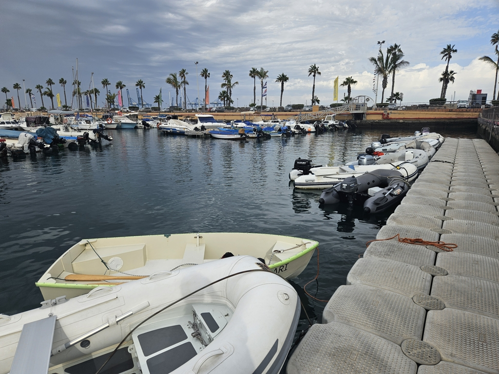
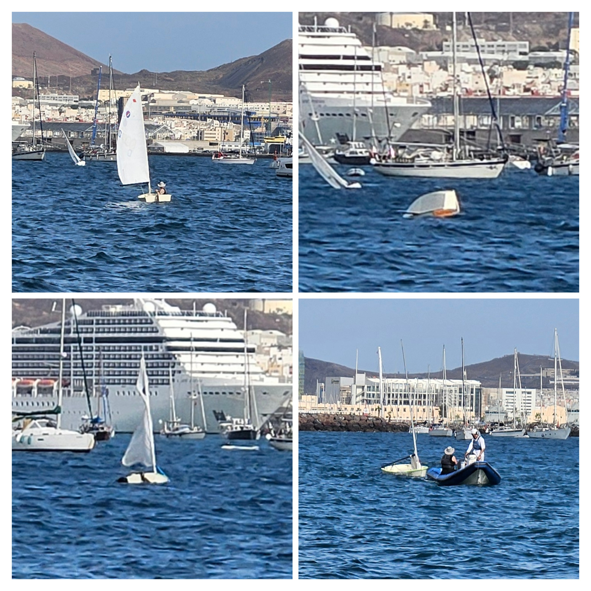

We checked in yesterday at the marina office and paid the anchoring fee. They asked if we'd also want to be added to the waiting list for a berth. Seeing the huge number of boats waiting outside, the chances felt slim, but we said yes anyway. After all, we _are_ a small boat.

 

On the same trip, I did the first reconnaissance to the big number of chandleries. Seems like we will be able to check a few items off our project list while here!

The temporary anchorage we were in was quite poorly protected, and the passing ferries caused quite big waves. Rolly and somewhat uncomfortable.

Today it was planned to be Suski's day out in the town. Since the anchorage is somewhat precarious, we wanted to have somebody on anchor watch and ready to react as needed. 

Suski set Isosaari up for sailing, and headed out towards the marina. As soon as she was past our small wavebreak, a gust came and the dinghy broached and capsized. She was able to right it quickly, but bailing while drifting in big waves turned out to be tricky. Luckily some local 2.4mR boats were out, and their trainer came to assist. Soon Suski was towed back home, the dinghy dried, and all things from her day pack laid out to dry in the cabin.

 

She decided to use the day for carpentry instead of a land adventure, and so soon we'll have a slight extension to the v-berth. I went on land instead, rowing just to stay on the safe side.

A chance encounter with the harbour master made a berth materialise. After a round of chandlery purchases (including new big dry bags for dinghy use!), we hoisted anchor and motored into the marina. Nice place, they even have a "Follow Me" dinghy to point you to your spot!

* Distance today: 0.7NM
* Total distance: 4400.6NM
* Engine hours: 0.5
