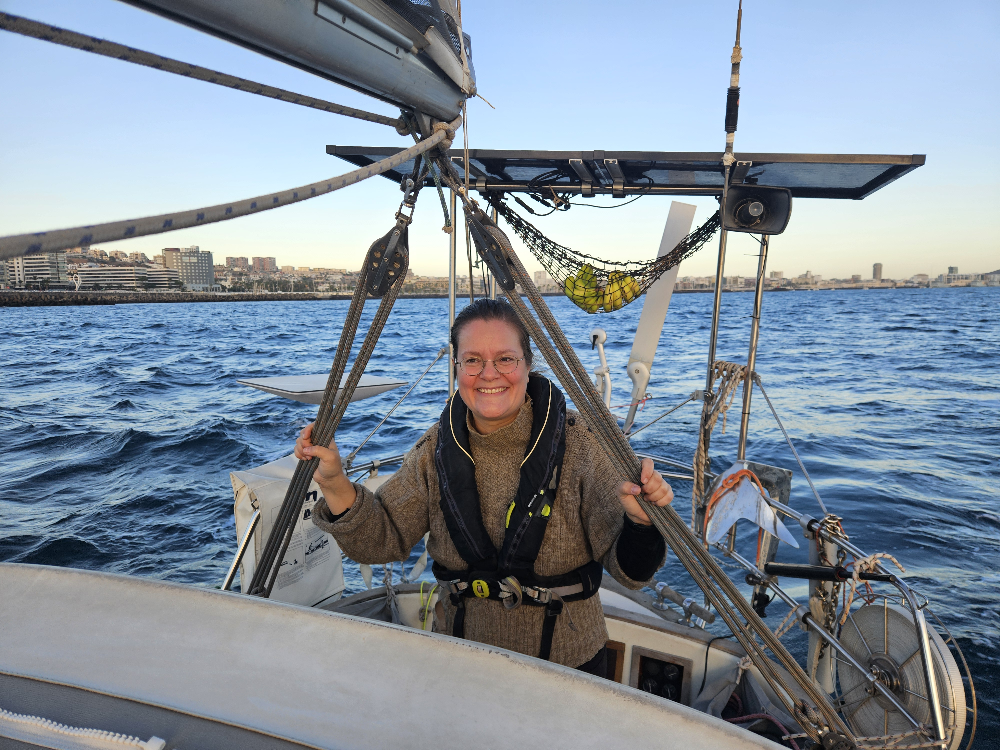
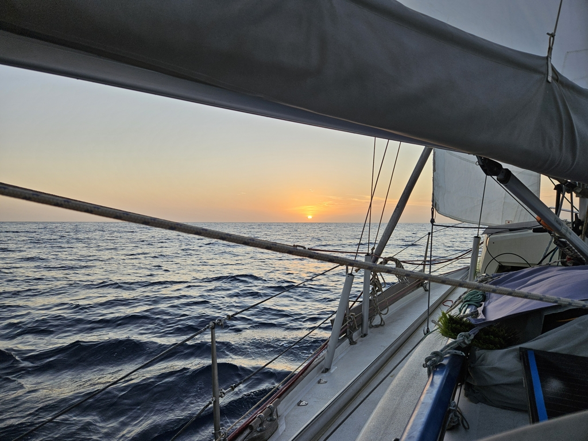

Finally we had the parcel from Germany and a suitable weather window for leaving! Next time we need something delivered to Canaries, its faster, cheaper and more reliable to go and get it your self and bring it as checked in luggage. Live and learn.

In the morning  we ran through our checklists and prepared the boat. Our boat neighbour was kind enough to offer his help so we gave him one of our bow lines to keep us from crashing into the pier while we waited for the slime line to sink before we engaged the transmission. Nothings spoils a day like a line fouled in the propeller. But we had none of that and reversed out of our slip like pros. Just outside of the wave break we were greeted by the waves coming all the way from the coast of Africa, we motored through and hoisted the sails outside the commercial harbours entrance as you are not allowed to sail inside the harbour. The old style wave break created a messy sea state as it was bouncing back the waves. As soon as we were past it, we could more enjoy the fact that we were on our way once again!

 

As we were rounding our turn towards south, we also found the windstill at the lee of the island, we motored a bit untill we were also protectec from the waves and proceeded to bob with only the mainsail up in the gentle swell waiting for the wind to fill itself back up from the north. 

 

As I'm writing this we are pointing south again with a bit of a breeze to be able to call this sailing. Ahead of us some 850NM and the sea.

* Distance today: 31.1NM
* Lunch: pea soup
* Engine hours: 2.5
