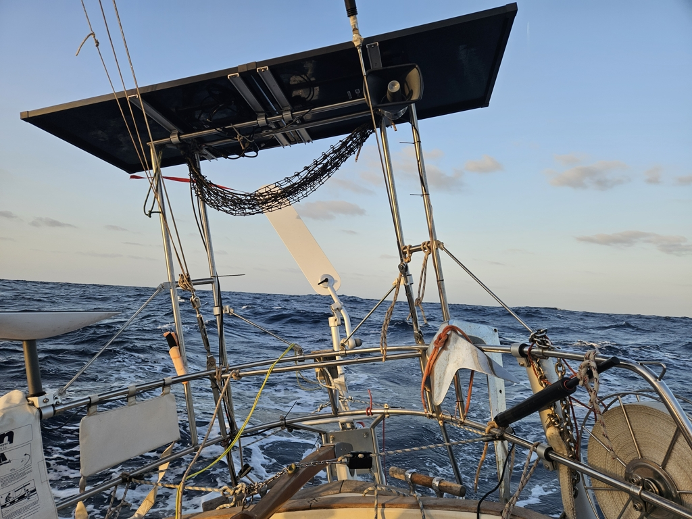

After a bit of sailing we again found the calm in the southwest corner of Gran Canaria. We motored through that, and were then able to start sailing properly. Soon we could switch to windvane steering, and gybe to the port tack that we'll likely keep all the way to Cape Verde.

Night watches were quite uneventful with some shooting stars. The first full day at sea dawned with mostly clear skies.
Wind direction has stayed constant, with speed fluctuating between 15kt and 30kt. The first reef and staysail seems a good combination for this range, and aided by current we've been making good progress.

 

Our fishing efforts suffered a slight setback, however. First catch of the day was a plastic bag that we'll dispose properly. Then half hour later some bigger fish bit the line clean off, taking our lures with it.

As we approach the original route line, we now prepared the whisker pole for going wing-on-wing.

* Distance today: 120.4NM
* Lunch: spaghetti with avocado sauce 
* Engine hours: 2.5
