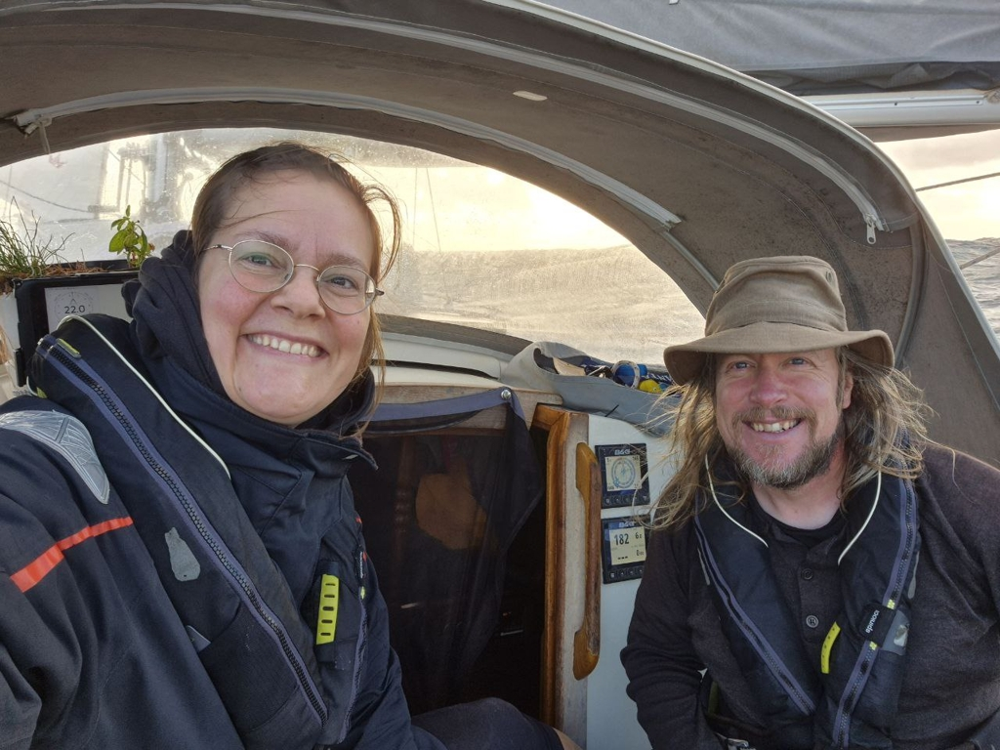

The night fell as we changed to wing in wing. Lille Ø is absolutely flying ahead. Just before midnight we were greeted by the first gusts over 30, so we decided to take the main to 2nd reef. With that  the windvane had no problem keeping up with the gusts. For about 12 hours we didn't need to touch anything,  Lille Ø was steering itself and we could concentrate on watchkeeping and the possible traffic, which out here there isn't much of. With the Calima winds from Sahara, the visibility hasn't been great ships 7 miles out are impossible to see, luckily AIS keeps good track of them. As we roll in to the third night we are happy little sailors, well fed, no sleep deptivation and even the batteries are nearly full as the hydro generator keeps us topped up. 

 

* Distance today: 135.3NM
* Lunch: Avocado salas
* Engine hours: 0
