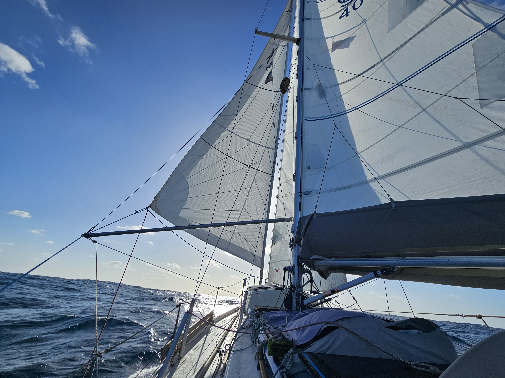

Last night was the longest of the year, and also the one with the heaviest weather forecast for this passage. We barreled down the nearly three meter waves with winds gusting up to 34kt. The sail plan of wing-on-wing with  staysail and the mainsail on 2nd reef kept things nicely under control.

The winds started moderating with dawn, and just before noon, we shook the 2nd reef out. In the afternoon, we switched to the modified trade wind rig with a partly furled genoa poled out, and staysail sheeted tight leeward  the reduce rolling.

 

Tropic of Cancer was crossed during the morning watch. Weather is still somewhat cool, but the conditions are starting to be quite pleasant for sitting in the cockpit reading a book.

* Distance today: 140.3NM
* Lunch: cheese and vegetable wraps 
* Engine hours: 0
