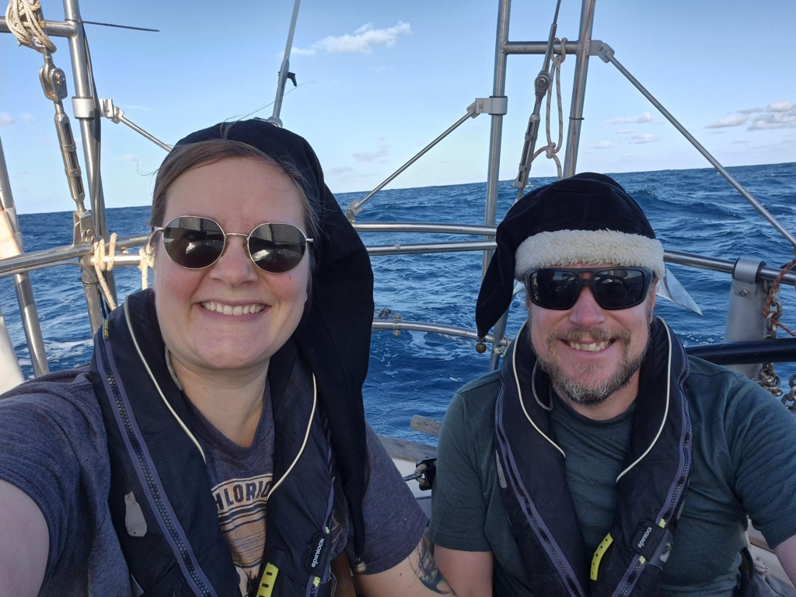
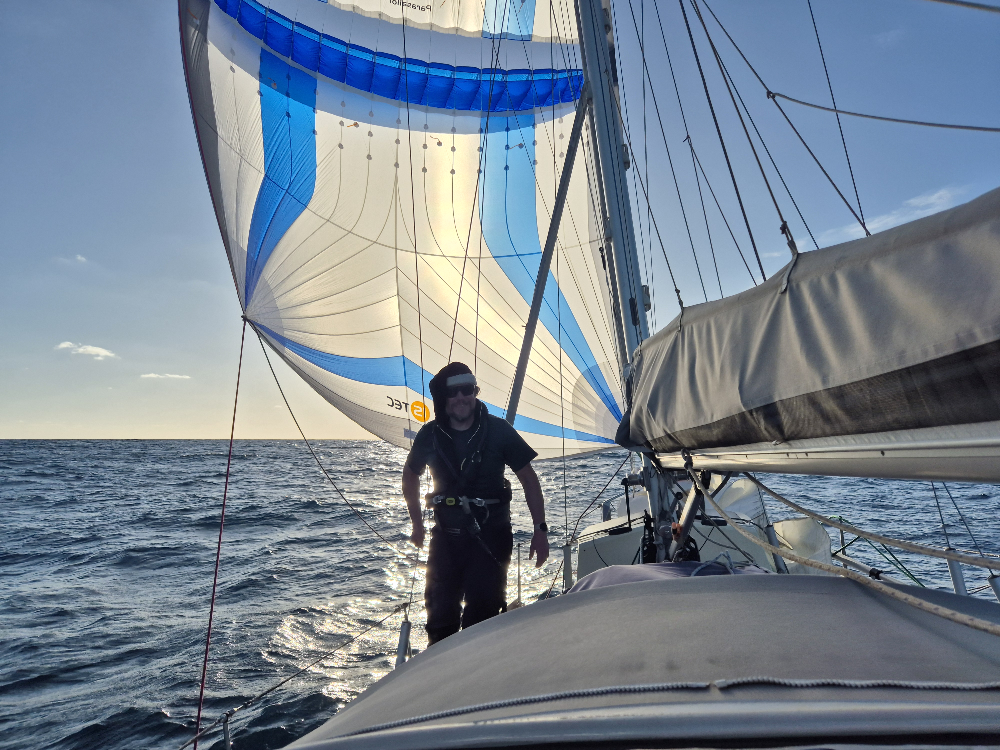

At sunset, a pod of dolphins came for a visit. In the night, we continued sailing in variable conditions, wind ranging from 10 to 30 knots. That required a sharp lookout from the person on watch.  

As the dawn broke, the winds became lighter, so we kept rolling out more genoa out. At noon, we rewarded ourselves with a fresh water shower. What a difference in mood to be clean!

 

Eventually the winds in combination with the swell meant that the main sail started banging loudly, so we took it down and tried a old downwind sailing trick, genoa poled out and the staysail was kept on the other side with the mainsail boom. Worked only semi well, and with the double headsail wing on wing, we were rolling side to side uncomfortably much. So, after a couple of hours of that, we dug up the Parasailor and are now smoothly riding towards Mindelo.

 

* Distance today: 130.1NM
* Lunch: sandwiches
* Engine hours: 0
