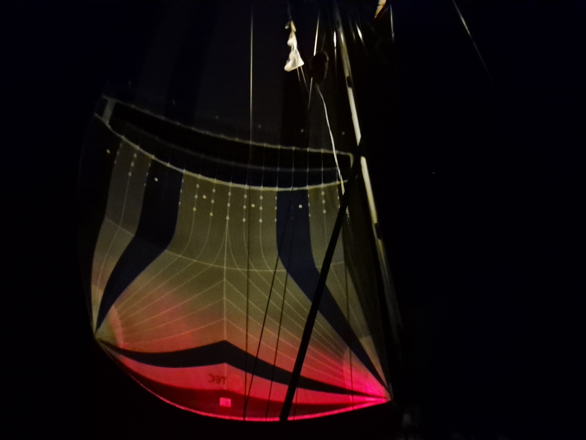
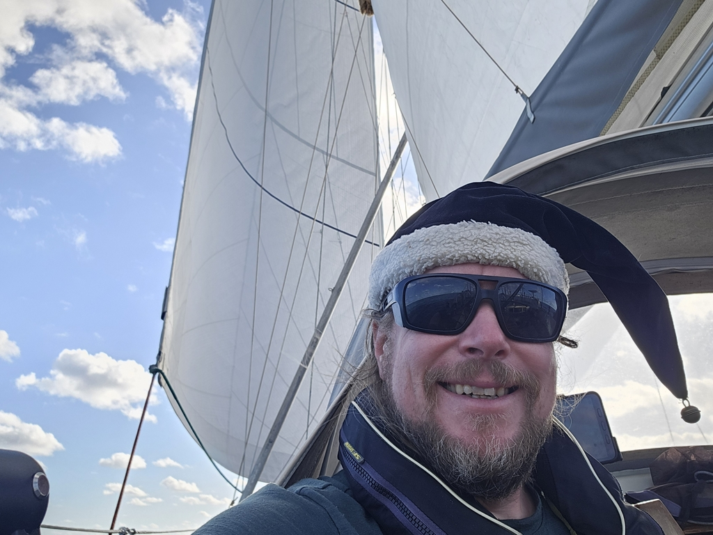

The Parasailor gave us a smooth ride throughout the night. As the moon rises quite late these days, we kept the "steaming light" on to keep the shape of the spinnaker visible.

 

At sunrise, we reached the totally calm patch. Parasailor went into its sock and deployment bag, and after a bit of drifting with just a poled out genoa, we started the engine.

We then made some Christmas video calls home. It is incredible that nowadays this is possible from the middle of an ocean!

 

In the afternoon, a slight westerly wind rose up, making it possible to sail slowly forward with an upwind configuration. This should keep picking up and turn northerly on Christmas day. Less than 300NM to go!

* Distance today: 93NM
* Lunch: Christmas porridge 
* Engine hours: 6
