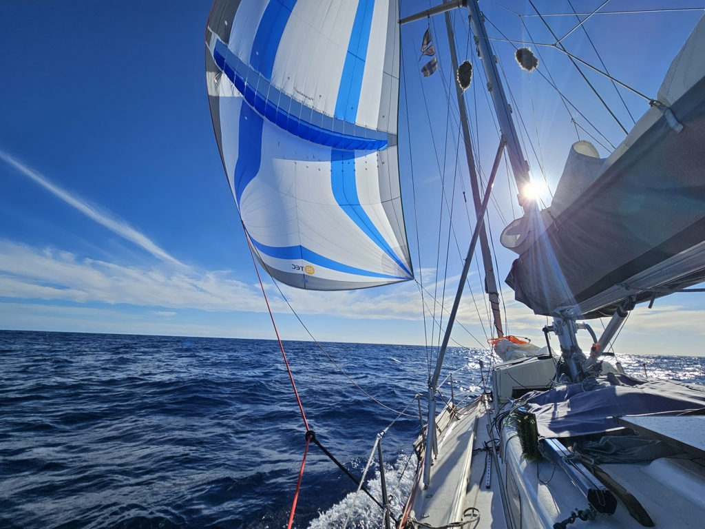

The wind kept varying during the night, so a couple of two hour patches were motored through the night. For Suski in the morning watch, the wind had steadied itself to a nice 12kn on the  beam. Lille Ø was eating miles on a good rate. As we finally caught our route line on the chart plotter and the wind weakened to under 10kn, we made the sail change to Parasailor. Wing on wing with weak winds is much more rolly, so we prefer the extra setup time and change to parasailor for these kinds of situations.

 

The ride has been smooth for the last couple of days, and both of us have been sleeping soundly on our off watches. This means that we are well rested and have actually been awake for some of our off watches. When sleep is patchy, you need to try and catch every single second of it, and you end up seeing your co-sailor only on a brief exchange when going from watch to off watch. This better sleep quality and more waking hours enabled social existence on this passage has been very enjoyable.

We should now be coming out of the calm patch, and winds ought to keep improving the whole way to Mindelo.

* Distance today: 83NM
* Lunch: Gazpacho
* Engine hours: 4.1
