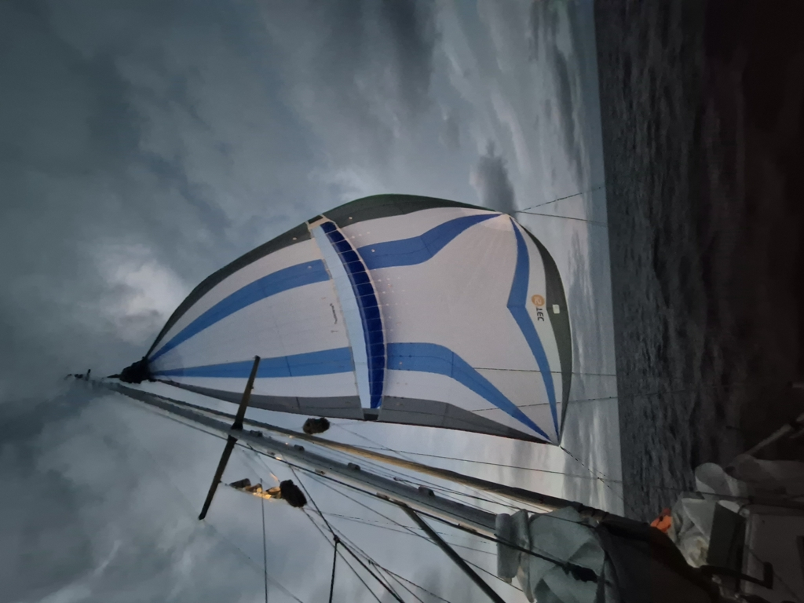

We sailed through the night under the Parasailor, gybing along the course line. This way, we could keep a bit more sideways pressure on the sail, stabilising our going even further. With the four line system, the Parasailor can generally be gybed single-handedly from the cockpit, but in the dark there is some risk of sheets getting tangled, and so we elected to time the gybes to watch changes so we could do them together.

 

The seascape around us has remained quite similar, though now with reduced wave heights.  Storm petrels swoop between the waves, occasional dolphins come to check us out, and every now and then, a school of flying fish takes to air in an attempt to avoid whatever dangers that lurk beneath the waters.

One thing that is new is that after a week offshore, we're suddenly not alone. The 16m sailing yacht _Dove_ has been catching up to us for a while, and after midnight, we could finally start seeing their masthead lights. Despite their longer waterline, they haven't so far overtaken us. Assumedly, they're keeping our pace in an attempt to time for an early morning arrival to Mindelo.

 

By noon watch the wind had picked enough that we switched from Parasailor to the white sails. This will give us easier options for slowing down or speeding up if we need to for a daylight landfall.

* Distance today: 103.6NM
* Lunch: pea soup
* Engine hours: 0
