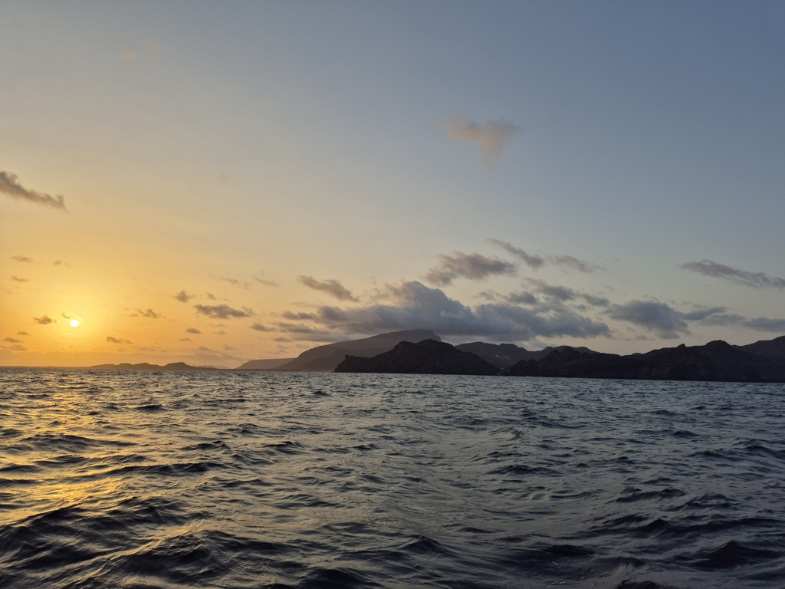

As the night grew darker, we were making good progress. Our targets of at least 25 miles six hours for arriving at noon were exceeded. We happily watched the arrival time to come closer and closer to sunrise, until we were about to arrive in the darkness. So we rolled in the genoa and eventually set the main sail of 1st reef. That though had an uncomfortable side effect, Lille Ø became rolly as the diminished sail area didn't have enough power to keep us tilting back over the centerline after a wave. Suski didn't get much sleep on her last off watch and was grumpy while getting into her watch. 

 

As the rising sun revealed the majestic landscape of Cape Verde the mood also improved significantly. We prepared the boat for harbour manouvers and radioed the marina. We got a guide boat directing us to the very last corner close to the shore. Now we can enjoy the city landscape from our back deck. After a nap I can see myself sitting in a nice restaurant for food and drinks. Kippis Karsten!

 

* Distance today: 65.6NM
* Lunch: later
* Engine hours: 0.7
