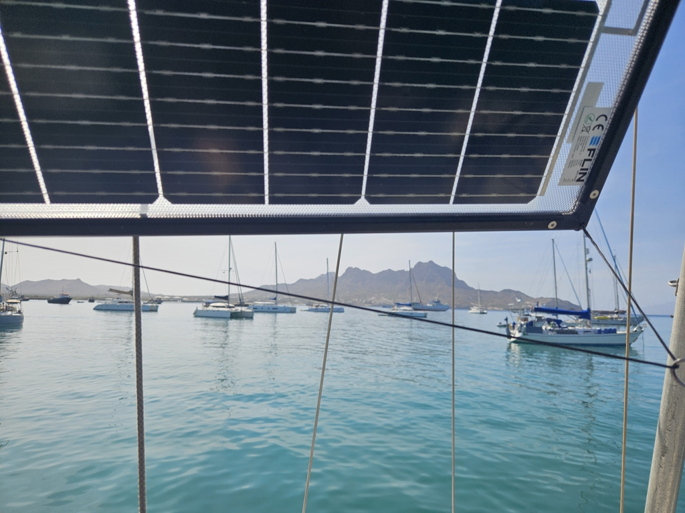

We spent a couple of days in the Mindelo Marina. Convenient location and friendly service. And of course a great place to meet other cruisers! We had fun evening aboard a Dutch boat, and heard the sad story of _Karolina Viking_ from her owners who are here trying to figure out how to fix the boat after the rudder failure.

We also did a few boat projects. The onboard NAS works again after a fried USB controller, and we did a full service on the watermaker that has been acting up since the Rías.

 

Now we need to make the water for the Atlantic crossing, and so we moved today to the town anchorage where the water is cleaner. After the membrane change, the watermaker seems happy again!

* Distance today: 0.3NM
* Engine hours: 0.3
