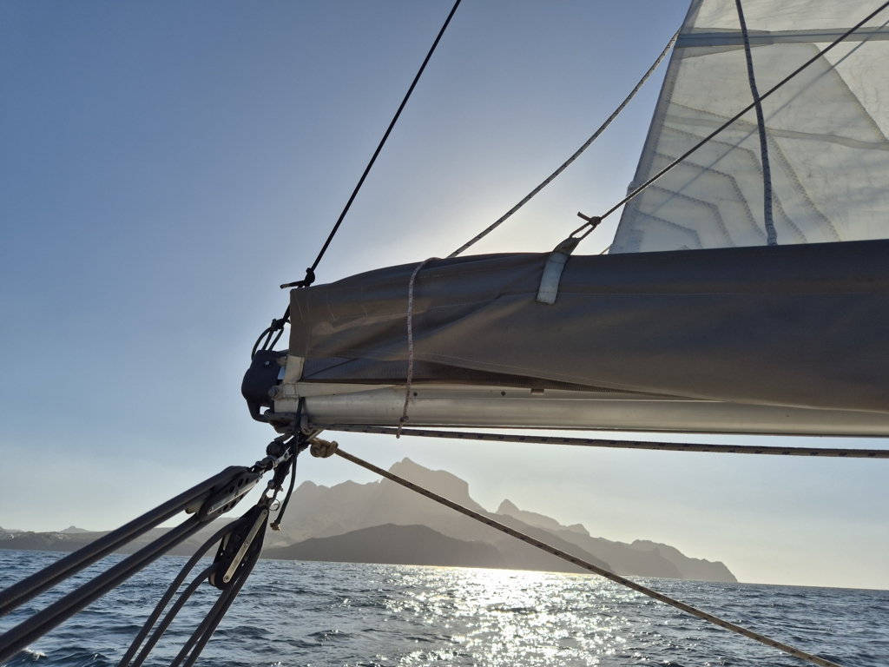
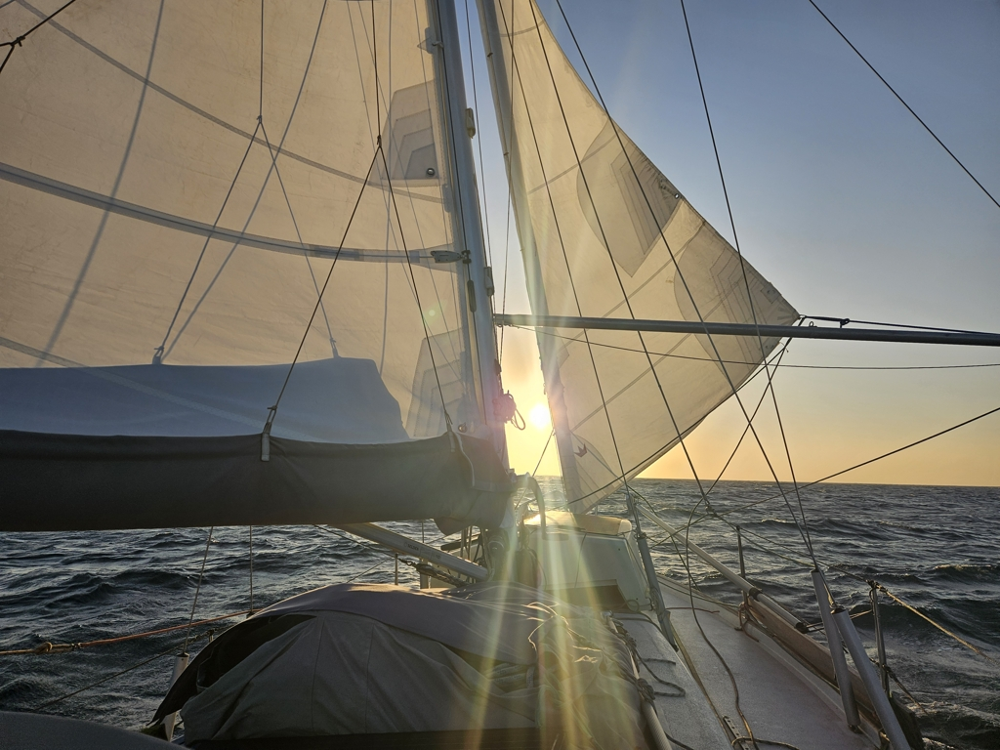

After celebrating new year it was time to head west. So in the morning we visited the immigration and harbour police and cleared ourselves out of the country. After that we got a bunch of freshies from the market and prepared the boat for sea.

 

Leaving from anchor doesn't feel like proper leaving as it is stress free. We hoisted the main in first reef and the stay sail. The wind funnels in between the island, here we have some 2.8 knots of current with us with 20 kn of wind. 

The bets have been made, I say we will see 5 other boats on the crossing and well take 18 days. Henri says 10 boats seen and 16 days. We shall see who will win.

 

* Distance today: 12.5NM
* Engine hours: 0.3
* Lunch: burgers
