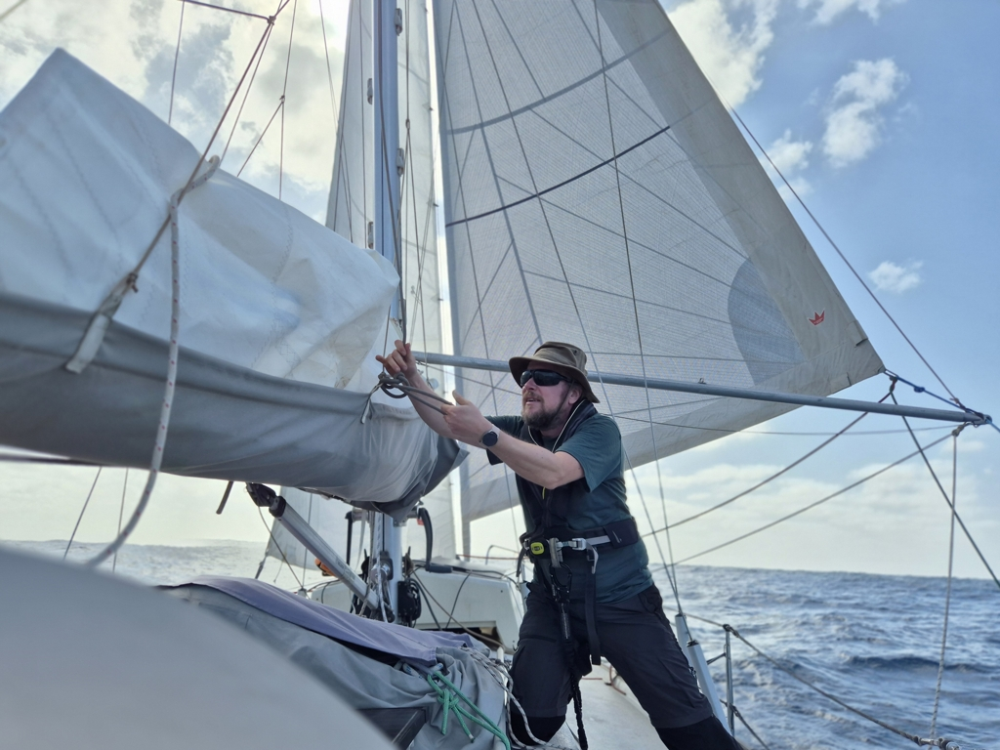
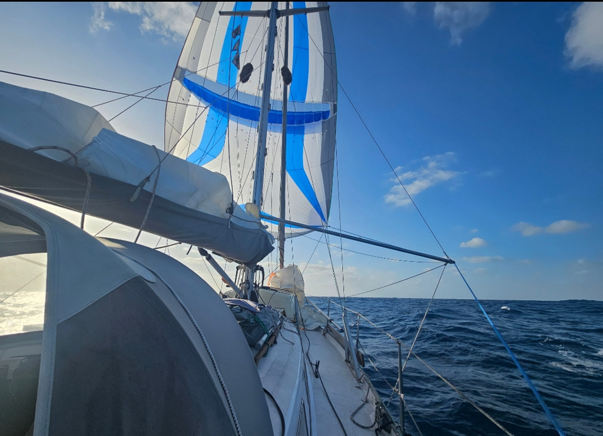

We've spent today sailing in quite turbulent conditions. At night, the curving winds drove us to the calm batch in the lee of Santo Antão. Off watch was roused, and we gybed to get out of there. Then we were back in the acceleration zone, winds gusting up to 33kt and pushing us along.
The night was quite fun, fast, downwind sailing. There are lots of shooting stars, and possibly the first glimpse of the Southern Cross.

 

In the morning, the turbulent conditions returned, with wind shifting 90° quite often, and speeds varying from 25kt to 4kt. We've proceeded west on a quite meandering course. 

 

This has required quite active sailing with very little uninterrupted sleep. Constantly tweaking the windvane and making many sail changes. Finally now as we approach sunset, we are sailing along with the Parasailor. We hope to get out of the influence of the land soon and into the more regular trade wind conditions.

* Distance today: 109NM
* Engine hours: 0
* Lunch: oven feta pasta
