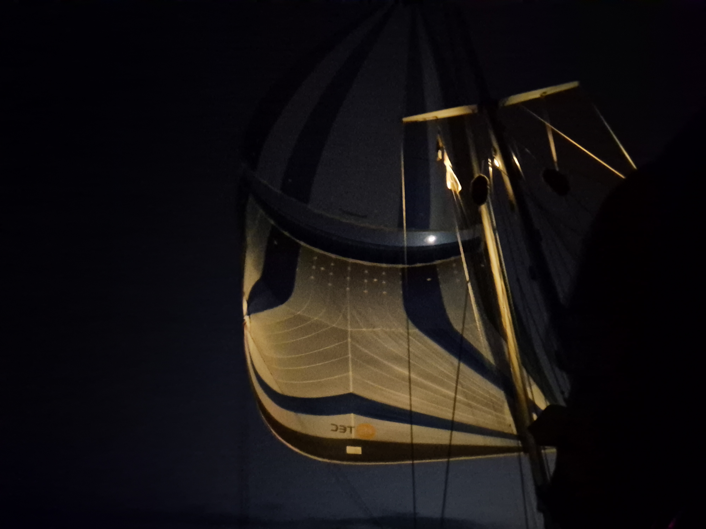

Seems we have finally reached the trade winds without any interference.  Base at 15 gusting to 20 from a stable direction. We are now flying double headsails as the occasional 25 kn gust throws the windvane completely off course when under Parasailor. With double headsail we are about 3 days slower than we would be with Parasailor, but I'll change that any day for more relaxed watches. We both had really good sleep on our off watches, so now for dinner time we actually have some time to hang out.

 

* Distance today: 126NM
* Engine hours: 0
* Lunch: Couscous salad
