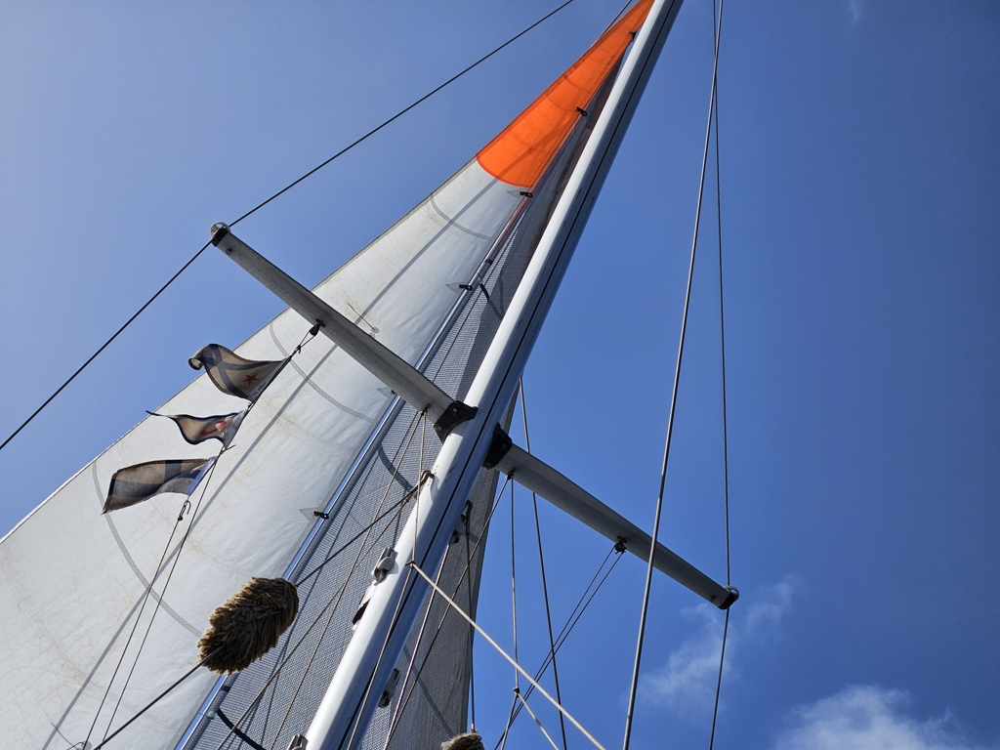

Today was the second day in row when we haven't needed to touch a thing since switching tl the double headsail setup. Winds have been blowing quite steadily from the northeast, and the boat sails itself.

 

The sky is filled with puffy clouds that help to make the tropical temperatures easier to deal with. And whilst they cut some of our electrical production, the hydrogenerator has helped us in keeping up. On a small and heavy boat like ours, it doesn't reach the sort of heady production numbers you'd see in brochures. But it keeps chugging along, day and night. In effect, it is like having a second solar arch!

With that we've been able to turn some excess energy into freshwater. The tanks are more full than when we left Mindelo, and we're already looking forward to the second freshwater shower of the passage.

* Distance today: 126NM
* Engine hours: 0
* Lunch: lentil coconut curry
