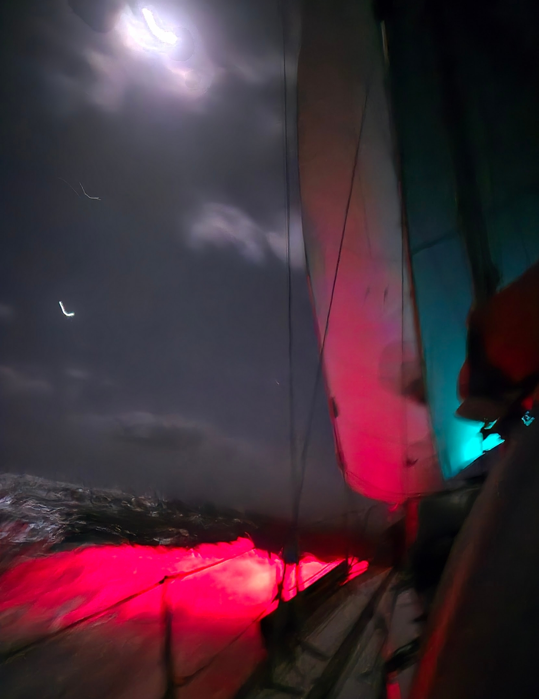
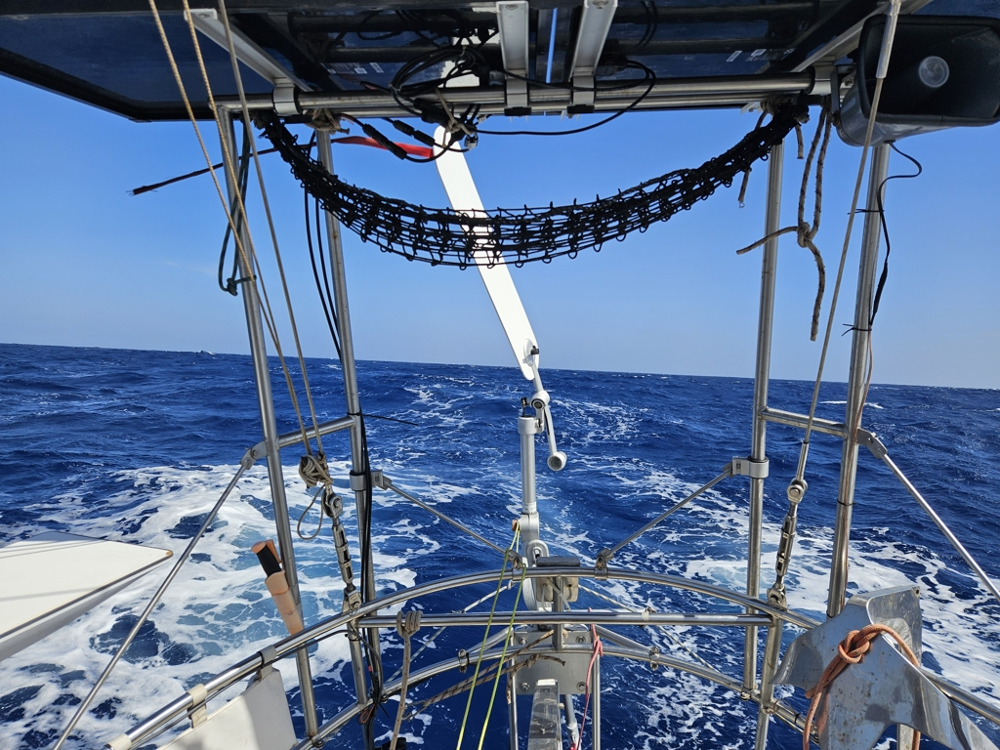

The topic on everyones' lips is the calm that is expected to develop between us and Barbados.  _Sya_ ahead of us warned about it, _Wenda_ behind us is for now steering towards the southerly route evaluating along the way if that is necessary. The two Swedish boats that we had a discussion over the VHF with are now doing a "banana curve" towards Barbados to avoid the calm.

 

We are following suit and slowly inching towards 13°N that is our current target for calm avoidance. It's nice to have a small community out here where we all take care of each other.

Cooking on the other hand is not the most enjoyable task under this sail setup and sea state. I have no idea what posessed me into making a chanterelll (thanks mom) pie where I need three pots in the process with not enough secure locations to keep them.

Somehow with a fair amount of cursing and helping hands holding things from the cockpit also that was achieved. 

 

* Distance today: 127NM
* Engine hours: 0
* Lunch: chanterelle pie
