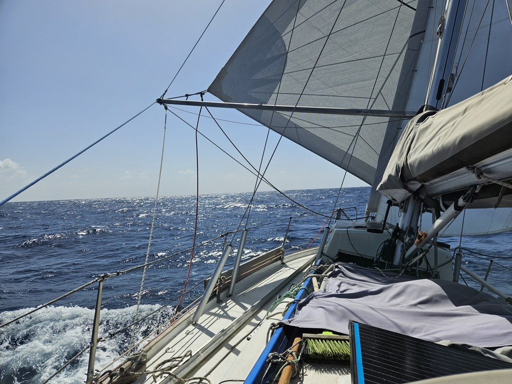
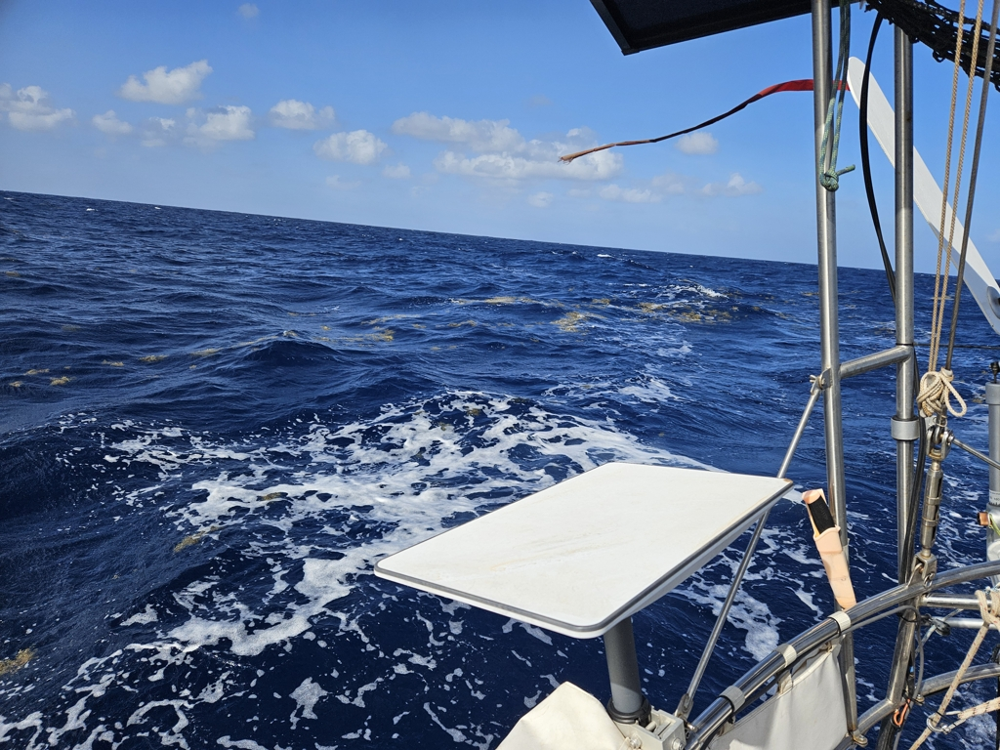

Today is another of those easy days offshore: we're trucking along at a quite steady 5kt without having to do anything else than maintain a lookout. At night, we passed the duo of Swedish boats (_Sawubona_ and _Lucky Winny_) again and had a short VHF conversation. This time, we could see them in the horizon, bringing the "boats seen" count to four so far.

 

Both the wind and the sea state have eased slightly. Enough that we are considering switching back to the spinnaker. That additional knot would certainly help with our energy budget. The lack of meaningful hydrogenerator production due to the slow speed through water has made a dent in our battery state. 

We're approaching our target latitude of 13°N, and will likely be able to make the turn west tomorrow morning. There is more and more sargasso seaweed floating about. Wildlife has been limited to an occasional storm petrel, and the ubiquitous flying fish flitting about.

 

* Distance today: 121NM
* Engine hours: 0
* Lunch: spaghetti aglio olio
