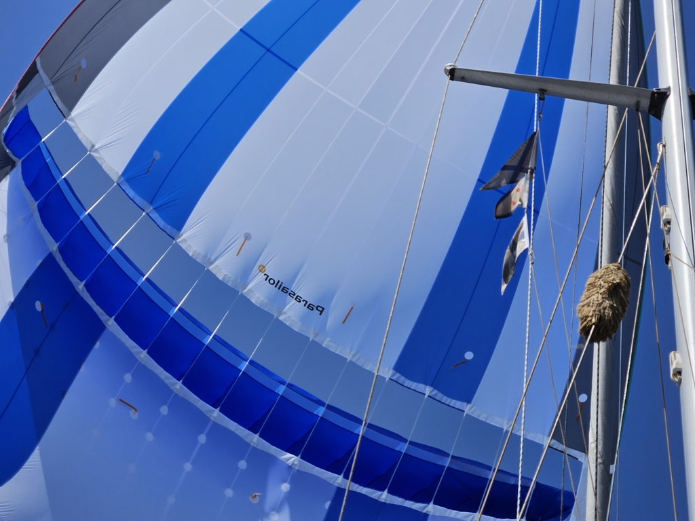

As the sun was setting we changed to Parasailor and gybed. The night flew by as we glides through the ocean guided by the moonlight, which now extends to also Bergie's watch. Over the night we got sargasso weed stuck on our hydro and servo rudder. "Release the salad!" echoed in our heads as a reminder of the epic CCCamp2019 trip where we ventured with our previous boat _Curiosity_, together with _Kumikana_ and _Julchen_. _Curiosity_ swimming deeper than ever with bilge full of beer and drinks and _Kumikana_ loaded full of food as the official "breakfast mothership". Then too various seaweeds would tangle themselves to the props of our outboards and periodic "salad removal" breaks were called upon.

 

Progress under Parasailor has been excellent and the mood onboard is good. Both of us have been sleeping soundly under the gentle rocking of Lille Ø.

* Distance today: 132NM
* Engine hours: 0
* Lunch: spinach pancakes
