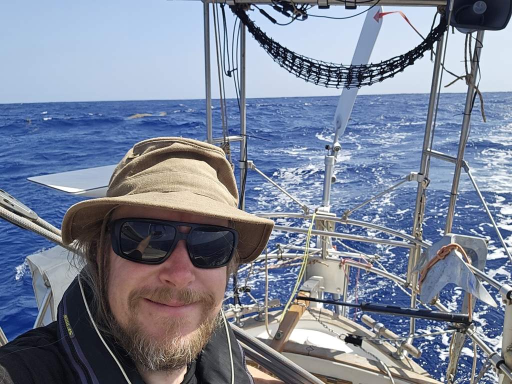
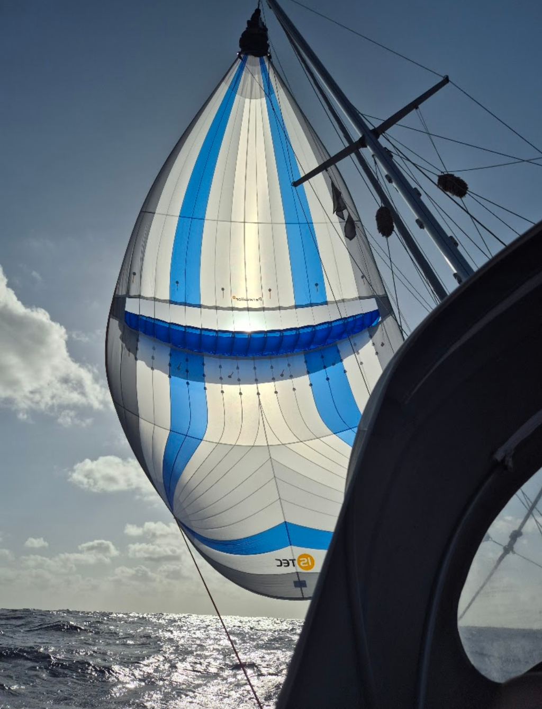

The wind started picking up just as we were having dinner. Once the pancakes had been consumed, we put the Parasailor in its sock and bag and hoisted the regular white sails. This was prescient, as it was gusting to 25kt most of the night. We were first on a broad reach and then later wing on wing.

By morning, the wind had reduced again, and we changed back to the Parasailor. As we've had some trouble getting the windvane to steer accurately with it, we are now back to the electronic autopilot for the moment.

 

When sailing across oceans, you typically move the boat time by one hour every 15° of longitude. We're now at nearly this point, and so at noon, we switched to UTC-2. This should again align the sunset and the dinner time. We'll have another timezone switch still ahead of us before Caribbean.

We also decided to switch the watch schedules around. Now Bergie will cook, and Suski will get the dishes. Suski will also get the darker of the night watches, though this is less drastic now, as the growing moon stays on the sky for most of it.

In the afternoon, we saw a sail on the horizon. This fifth boat spotted on the trip was _Lady Blue_ bound to Martinique, gybing across our bow. We had a short VHF chat. We're also occasionally hearing _Lucky Winny_ and _Sawubona_ on the radio, so it's getting crowded here in the mid-Atlantic!

 

* Distance today: 129NM
* Engine hours: 0
* Lunch: pea soup
