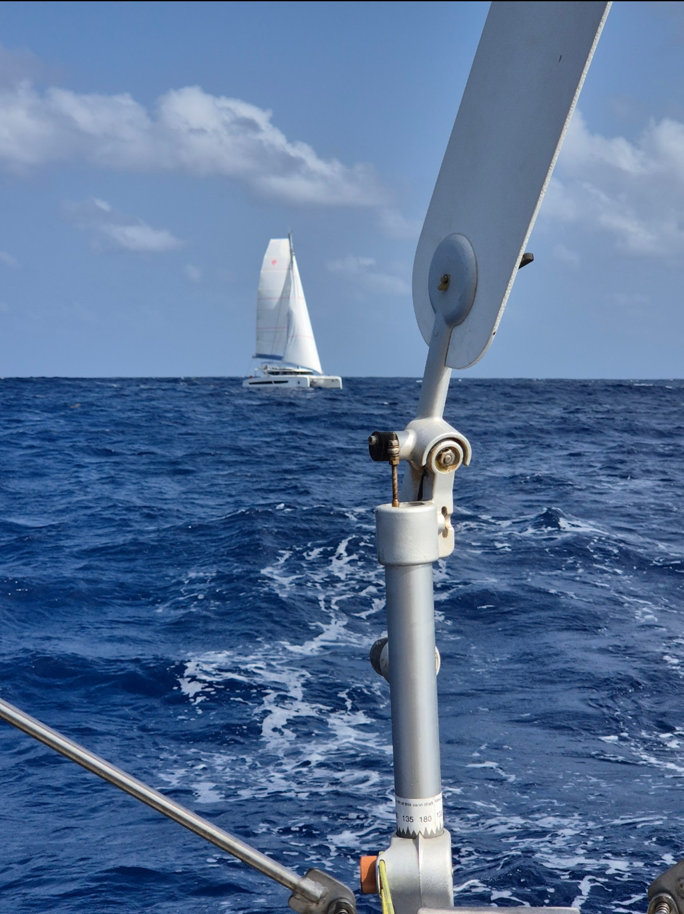

The lighter conditions have us running with Parasailor for now. The first reversed watches took a bit of getting used to, but it is only fair that Bergie gets to enjoy the sunrises too.

 

Today's excitement came with a passing catamaran Beachcomber as we passed only with 0.2 nm distance. We radioed to each other well in advance to make sure we have seen each other. We decided to take this opportunity to get some photos of each others. Havel vibes indeed!

* Distance today: 125NM
* Engine hours: 0
* Lunch: mujaddara
