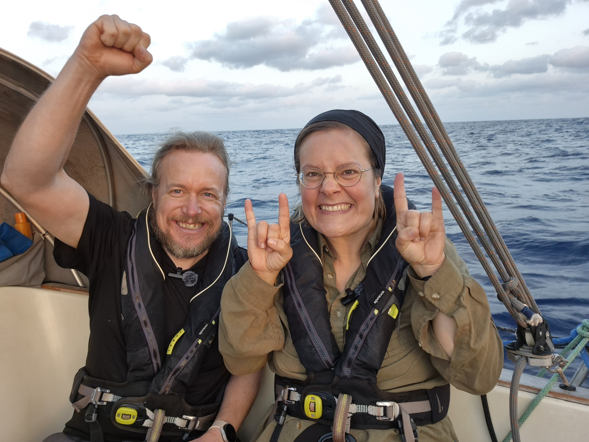

In the evening we ran into some lighter winds, making the night a slow but comfortable ride. Sea state had also quieted significantly. At sunrise, a milestone: we reached the halfway point of the trip. 1066NM behind, 1066NM ahead.

The off-watch was roused accordingly and the halfway point celebrated in the traditional manner, providing both for the sea, the vessel, and the crew.

 

Slightly afterwards wind shifted and picked up, and now we're back on direct course towards Barbados, pushing ahead at almost 6kt.

* Distance today: 115NM
* Engine hours: 0
* Lunch: macaroni casserole
