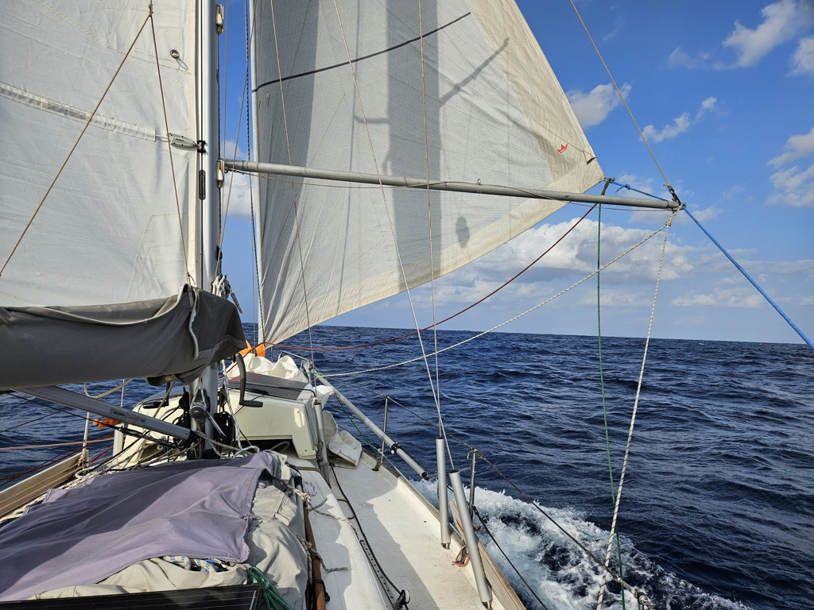

At midnight we dropped the Parasailor and continued with wing on wing, main on 1st reef and genoa partially rolled in. The nearly full moon guided our way nearly until sunrise. The moon is so bright that it obfuscates the stars nearly completely. Only the few brightest ones are visible now.

 

During the day the wind died down a bit but as it is expected to pick back up for the night, we decided to continue with white sails up. 

The distance to destination number has changed to mere 3 digits, so clearly progress has been made!

* Distance today: 136NM
* Engine hours: 0
* Lunch: bibimbap
