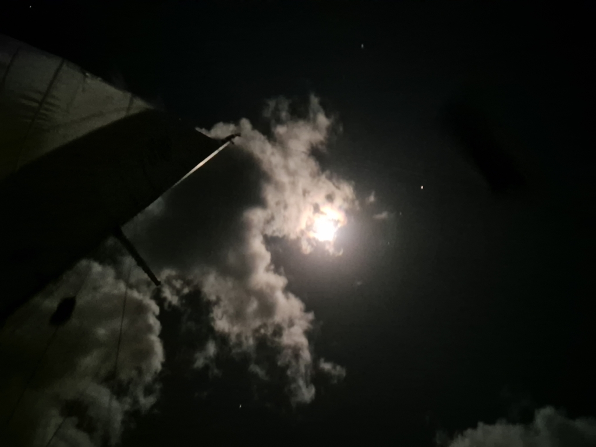
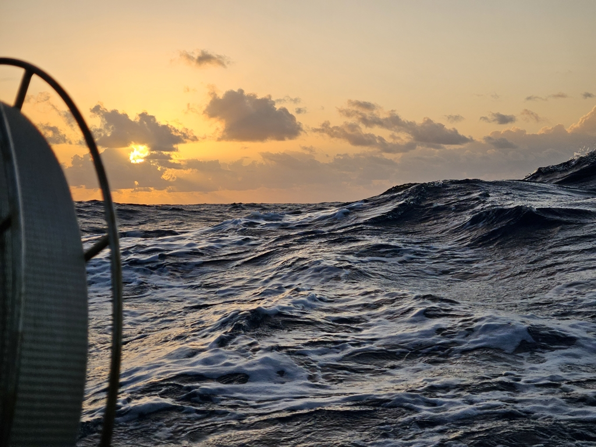

The night went quickly on a fast broad reach, with winds gusting up to 25kt. In the morning, we rolled out the genoa to wing on wing and continued along our course.

 

Seas are again quite big, but most of it is a long, gentle swell rolling from the north. Now we're considering whether to continue with the white sails as the winds trend downwards on when to again hoist the Parasailor. Such things are best done at watch changes, which means either now or at midnight.

 

On such a long passage there is also time for some maintenance work. Yesterday, we retied the spinnaker halyard knot to get rid of some chafe. Suski also re-soldered the broken charging port on our logbook printer. And we have even been able to remotely debug some Signal K setup issues on another boat crossing the Atlantic a few days ahead of us. Remote debugging on the open ocean, awesome!

* Distance today: 130NM
* Engine hours: 0
* Lunch: spaghetti with tomato sauce
