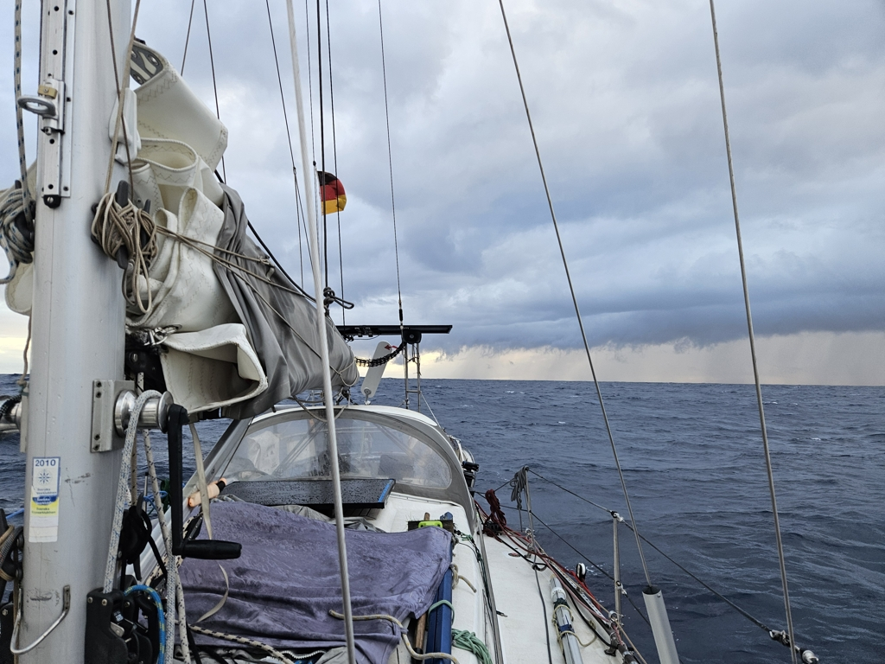

In the morning the sleeping off watch was awoken to take down the Parasailor. A series of squalls were approaching and they can bring with them a fair bit of wind. The first came while the parasailor was up and with it, the wind went from 7 to 22 knots in seconds. The rule of thumb is, squall without thunder is up to 25kn and with thunder up to 50kn of wind. We got the parasailor down , with what by now is a good routine and hoisted only the staysail instead. With the following squalls we saw winds up to 28knots.

 

After the squalls had passed, the wind basically died down completely, so we decided to leave only the staysail up as we drifted along bobbing up and down. As the wind slowly started to fill up Suski rolled out the genoa and when Henri was awake again it was time to hang the parasailor up to dry.

 

* Distance today: 90NM
* Engine hours: 0
* Lunch: navy bean soup
