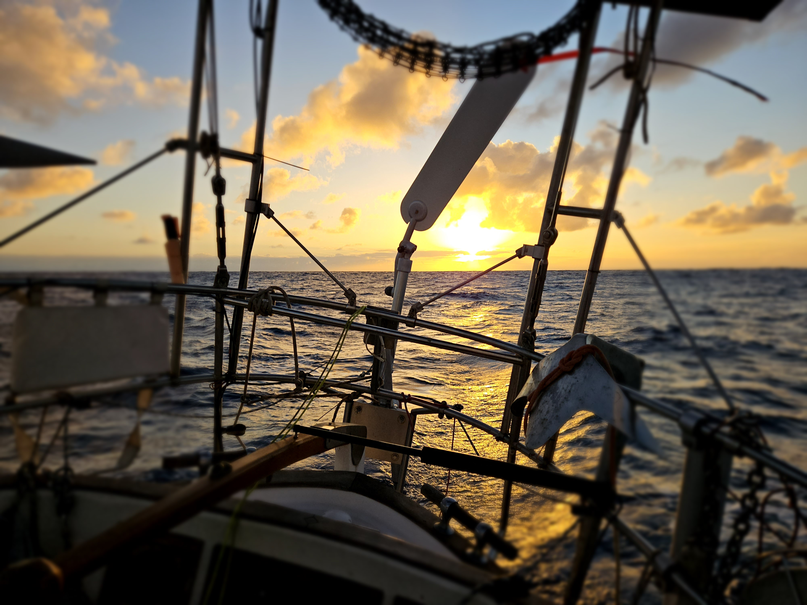
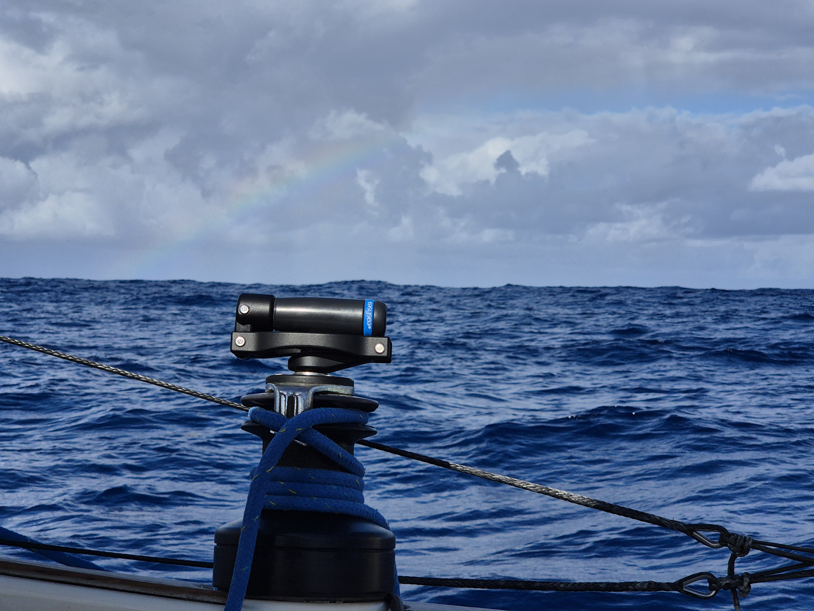

Due to the close by squalls, we decided to switch for the white sails for the night. What followed was a pretty perfect night sail under the full moon and some puffy clouds.

 

Morning followed with pretty much the same rhythm, but then in the afternoon, the area of squalls finally caught up to us. We managed to not get rained on, but there were still some quite strong puffs. And in the meanwhile, the base wind kept dropping.

With that, we were left with quite frustrating conditions: big rolly seas and light winds. Too light to keep the mainsail filled. The wind speed would've been fine for the Parasailor, but with squalls all around us, we didn't dare to risk it. But at least we saw a rainbow.

 

We moved the ship's time by one hour again today to realign sunset.

* Distance today: 107NM
* Engine hours: 0
* Lunch: tofu cashew curry
