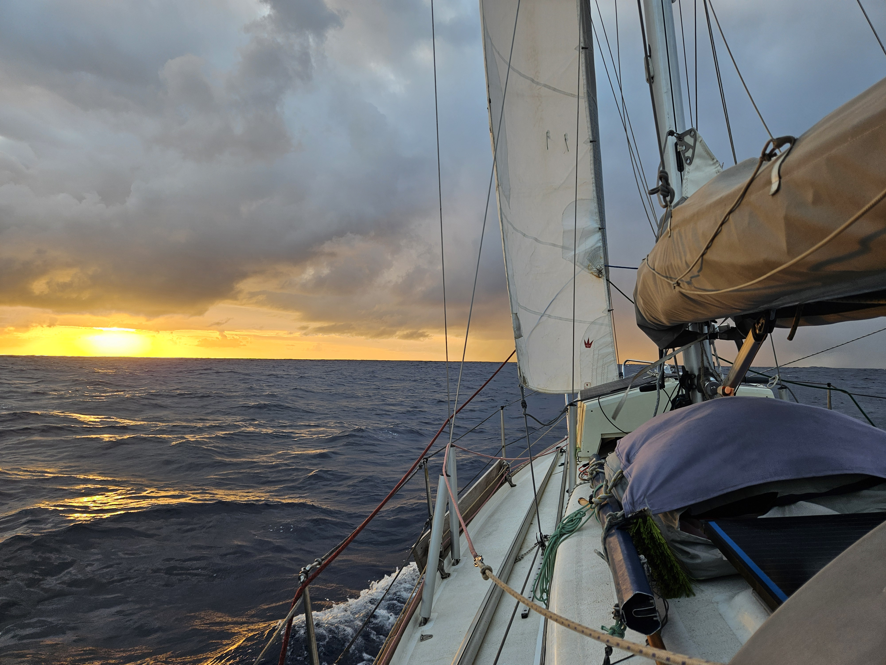

In the night the squally conditions continued until the early hours of morning. Then finally we settled to clear skies and low winds. With both headsails we had no unnecessary flapping in our sails, so we slowly made our way forward. The same continued till about dinner time when a small winshift gave us the opportunity to raise the mainsail again and be on a starboard tack with true wind angle in 130°. 

 

As Carribean gets closer we have been putting more thoughts into our arrival. Barbados would be the closest, but it has no protected anchorages, Martinique on the other hand has several, but is further away. The long time prognosis gives us a fair bit of wind for next week and beyond, so having a secure anchorage may weigh heavier on the scale. The online-only check in process for Martinique is also an added bonus as after this long voyage dealing with bureaucracy straight upon arrival might be a bit much. Instead I dream of a long uninterrupted sleep in a boat that only gently rocks and doesn't roll.

* Distance today: 87NM
* Engine hours: 0
* Lunch: pea soup
