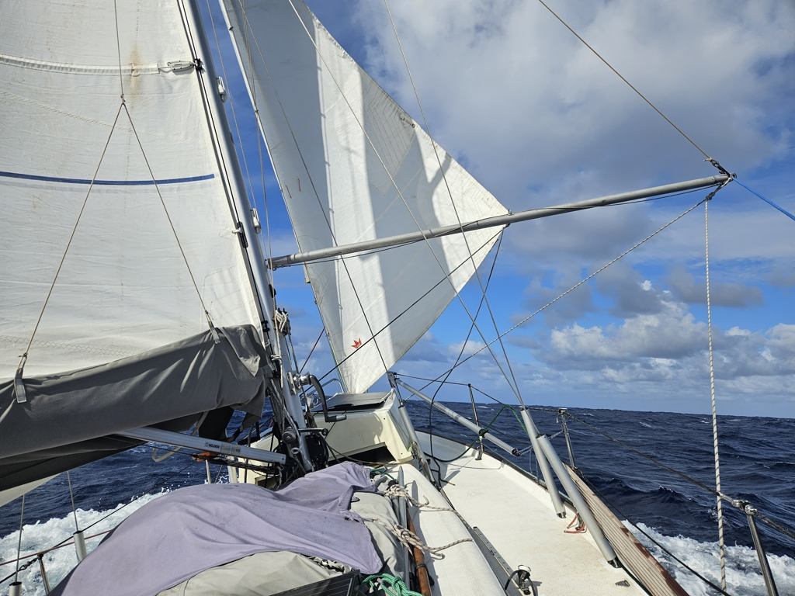

Finally sailing fast again! In the evening, we set the mainsail into 1st reef, and overnight kept rolling in more and more of the genoa. At sunrise, we swapped it to the staysail and put the main to 2nd reef.

 

With that setup, we've made good progress west. There have been some squalls, but they've mostly missed us. The combined sunshine and fast sailing have also replenished our batteries quite efficiently.

Seas are a little bit confused with the varying squally wind directions. I actually fell on the floor from the saloon settee while making some video edits, as a wave broke under us. No damage to me or the laptop. But it looks like the wavetrains are starting to settle on a direction now.

We're in daily contact with several boats currently doing this passage, and the speculation on the best landfall option is currently quite active.

* Distance today: 125NM
* Engine hours: 0
* Lunch: open feta pasta
