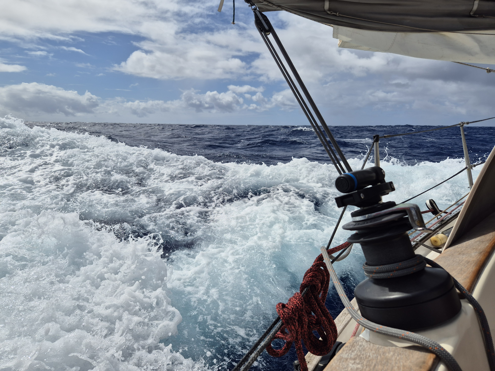

The squally conditions continue. Before squalls we absolutely fly forward and behind them we slow down to a snail pace. With a bigger crew we would probably opt in to more frequent sail changes and so be faster, but as it is just the two of us, we rather go with a conservative sail plan and be ready for the high winds even if we are slow in between.

 

Today was also the 'Fahrtenseglerabend' of our club SC Gothia and we took a short video call with them. Was nice to see and hear all of them! And luckily for that short moment we had decent wind and no rain!

 

* Distance today: 128NM
* Engine hours: 0
* Lunch: chanterelle risotto
