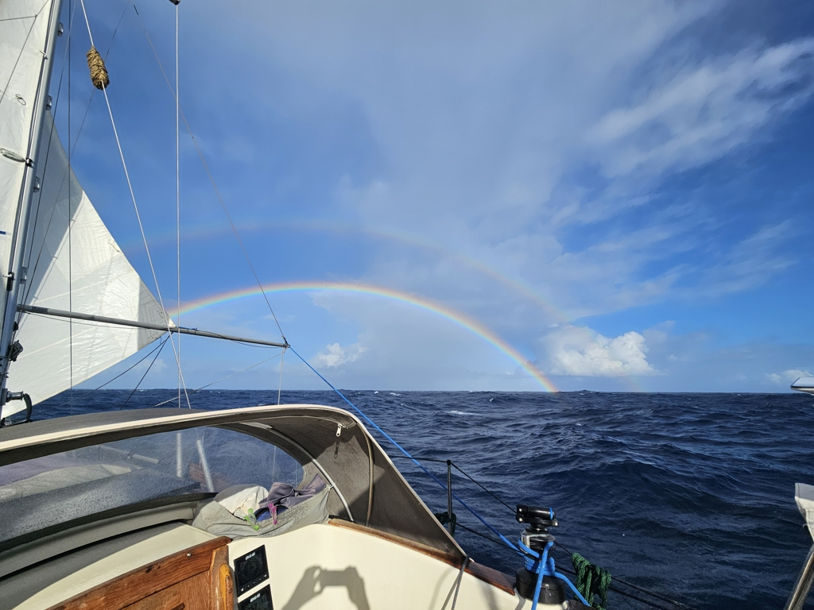

The night was quite sporty. Between the big seas and the wind varying from 15kt to 35kt, the windvane had a hard time keeping up. This meant we needed to be constantly ready to intervene.

In the darkness, it was raining not only thanks to the squalls but also flying fish. Suski got hit by one in the chest, and we ended up tossing dozens overboard from the cockpit floor, side decks, and even our deck drains.

 

One positive to this wet weather is that the boat is looking a lot cleaner. Lots of the accumulated Sahara sand is now gone.

We can now see Barbados on our plotter offshore zoom level, and will be leaving it to port.

* Distance today: 135NM
* Engine hours: 0
* Lunch: spaghetti again olio
