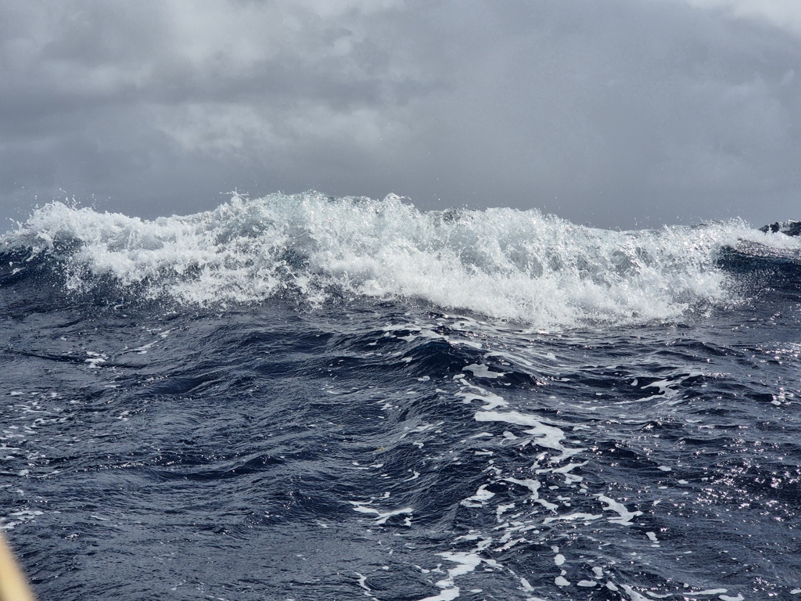
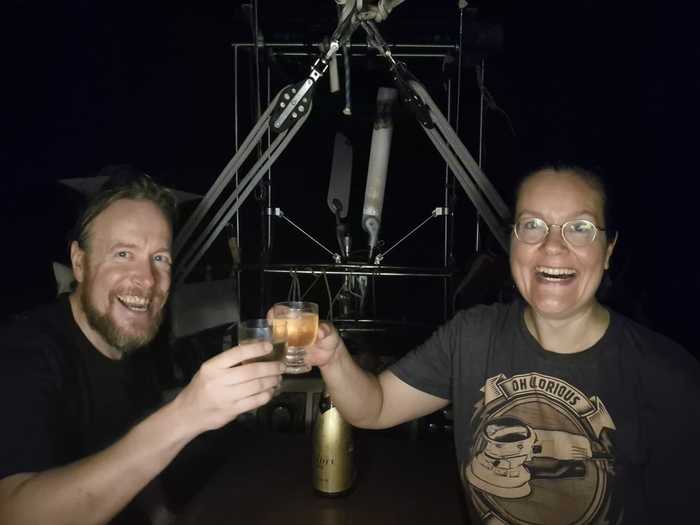

The windy conditions continued, and waves kept building up. We kept sailing on, tending to the windvane whenever one of the breakers pushed us off course.

 

This was the worst sea state we've ever had, wave height over 3m, cross seas, and lots of breakers. We got a few good ones into the cockpit as well. But on the other hand, we managed a respectable 143NM in 24h.

Just before dinner, a shout: "land ho!"
The hills of Martinique started appearing from below the horizon, later followed by St. Lucia. We knew we wouldn't make it to the anchorage before dark, but slowing the boat down wasn't appealing in these conditions. Better to seek the lee of the land and then see what we do.

As it happens, the Sainte-Anne anchorage area is huge. We carefully motored into a position well removed from all other vessels, dodging some lobster pots while doing it. Then anchor out of the locker, and down into the bottom. Now we can enjoy a well-earned proper night's sleep, and seek an anchoring spot closer to the dinghy dock tomorrow at daylight.

  

So that's it, after 2.2k nautical miles, the Atlantic Ocean is now behind us and we can start looking forward to the Caribbean adventures.

* Distance today: 165NM
* Engine hours: 0.7
* Lunch: lentil coconut curry
