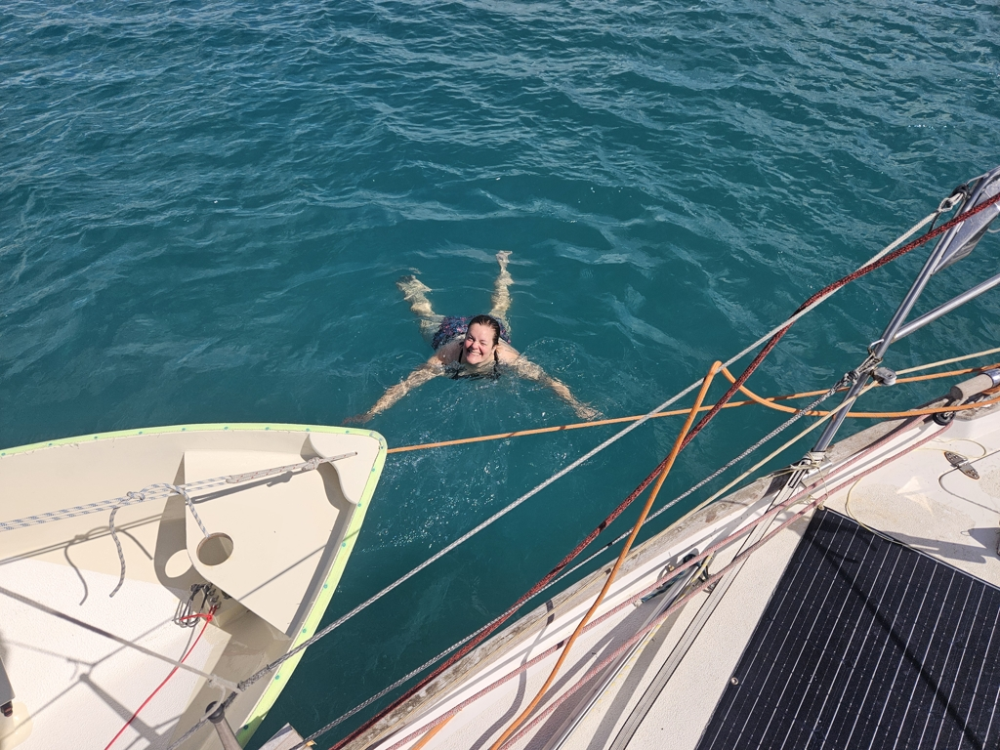
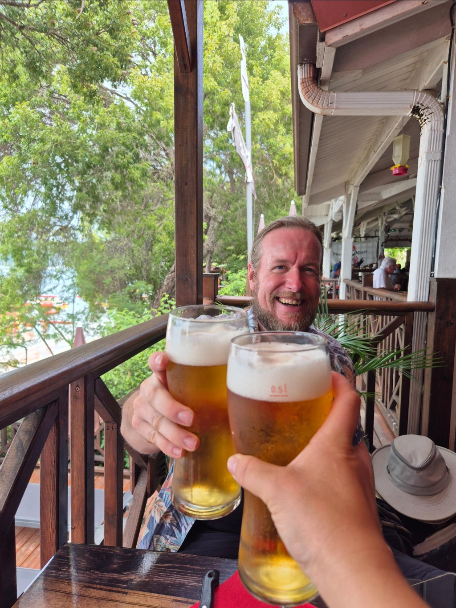

Today we were finally motivated and awake enough to re-anchor closer to shore. So anchor up and to the midst of all the other boats!

 

We slowly meandered through the anchoring field until we found a spot right at the edge of the swimming area, half way between a pirate bar and Sainte-Anne dinghy dock. Just the perfect little corner for us.

 

Kippis, Bernhard and Jouko!

 

* Distance today: 0.8NM
* Lunch: burgers and beer
* Engine hours: 0.8
