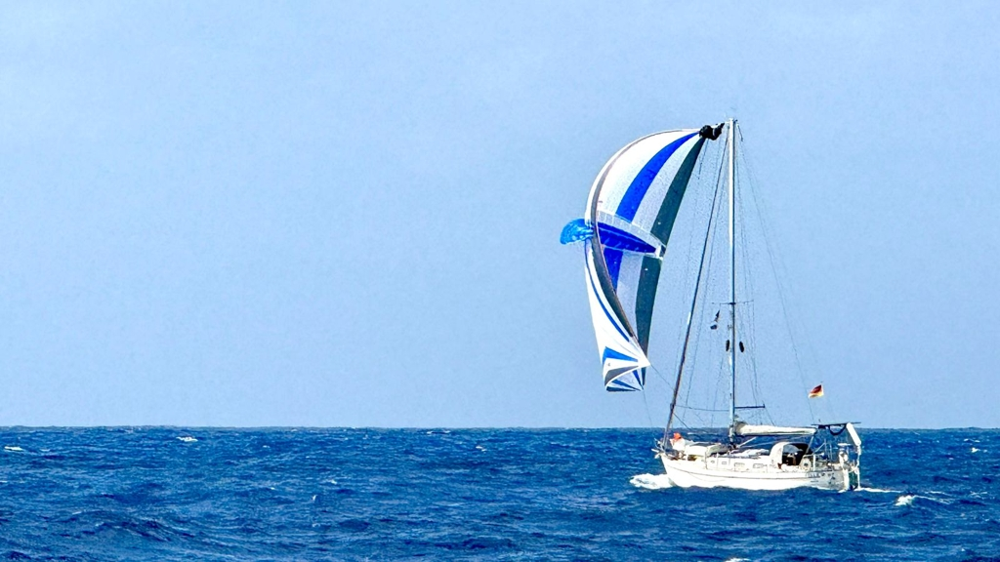

This post will mostly discuss the technical aspects of the crossing, what worked and what didn't. For the actual story, you can read our blog posts from along the way.

<!--more-->

## In numbers

Lille Ø is an Amigo 40, a 9.35m double-ender with a full keel. Built in Sweden in 1979. We sail her double-handed, using a six-on, six-off watch schedule.

Passage from Las Palmas to Mindelo was 901NM and took 8.5 days. An average speed of 109NM per day, or 4.4kt. We had some strong wind days, but also spent time becalmed.

From Mindelo to Martinique was 2225NM and took 18.3 days. Average of 122NM per day, or 5kt. Best day trip was 143NM.

## Planning

We wanted to do the Atlantic crossing in early January when trade winds are more established. We also had a slight constraint of some guests coming on board in Martinique in early February.

Our original plan was to cross from Canary Islands to Cape Verde in early December, then spend a couple of weeks cruising the islands between Sal and Saõ Vicente. A parcel was delayed, and so we were only able to depart Las Palmas on December 19th.
Because of this we decided to cut out the Cape Verde cruise, and only stop to celebrate New Year in Mindelo.

The weather window from Canary Islands to Cape Verde wasn't ideal, with both some stronger winds and a calm patch in the forecast. We decided to take it nonetheless, as the winds around Canaries had been quite weird all of the early winter, and a better window wasn't in sight.

For the crossing from Cape Verde onwards we didn't spend a lot of time looking at weather. This is the right time of the year for stable trade winds, and the trip is too long for proper weather routing anyway. We could get weather routing solutions from both LuckGrib and Orca just before the half-way mark. Our plan was to arrive to Barbados, but we changed this to the better protected anchorages of Martinique in the latter half of the passage due to some heavy weather in the forecast.

## Sailing

The passage from Canary Islands saw everything from sustained winds over 30kt to dead calm. From Cape Verde onwards we've been in trade wind conditions, with wind ranging from 10kt to 25kt, a calm patch with no wind for 12 hours and the stop-and-go conditions of the squally area in the last quarter of the passage. Then we had anything from 5kt to 37kt, often in quick succession.

Due to the varying conditions, we got to use our full sail inventory on both passages. We used everything from the double-reefed mainsail and poled out staysail to the Parasailor. Only the storm jib and the spare mainsail have stayed in their bags.

Since we sail double-handed, we try to schedule any sail changes to watch changes. This means we generally have to sail with a bit more conservative sail plan than would be optimal. Prioritising sleep is important, and flying too much sail could mean a lot of abrupt wakeups to help reef. Halyards and reefing lines are all at the mast. Our policy is that in ocean conditions nobody goes to the mast without the second person present in cockpit.

The Parasailor has likely been the MVP of this trip. We can use it anywhere between 7 and 20kt of wind whenever it is from aft of the beam. The sail is easy to fly, and thanks to the wing it stabilises the motion of the boat. This makes everything smoother and more comfortable on passage.

Especially on the Atlantic crossing we've been able to fly the Parasailor for days on end, only taking it down when wind started picking up above comfortable numbers. We also flew it at night, keeping the sail visible by turning the steaming light on.

We experimented with the traditional trade wind rig of double headsails, with the genoa poled windward and the staysail flying to the lee. This works fine for conditions that are too rough for the Parasailor, but is a little slow, and doesn't do much to reduce the rolling of the boat.

In the last quarter of the Atlantic crossing we started encountering tropical squalls. These could bring the wind from 10kt to 36kt in seconds, and then leave you wallowing in calms for hours afterwards. These made sailing a lot trickier, and we had a few really slow days with just the two headsails up.

Steering has been a combination of the windvane and the electronic tiller pilot. Windvane works great in most conditions, but the tiller pilot has been better for light winds. 90% of the trip was steered by the windvane. During the really squally conditions and big seas in the end the windvane needed nearly constant adjustment to stay on course. The gooseneck barnacles that colonized our rudder along the way certainly didn't help!

On the passage to Cape Verde we had to motor for almost a day to get through a calm. On the Atlantic crossing we didn't motor at all, deciding to rather just drift with the favourable current in the two patches where we got becalmed.

## Energy

Out boat is equipped with 560W of fixed solar panels (240W on the aft arch, 120W on cabin top, and 200W on top of the dinghy tied to the foredeck). In addition we have a SailingGen hydrogenerator. For anchorages we also have a 300W FLINsail solar array that can be hoisted like a mainsail, but that obviously doesn't matter on a passage. We have an 80A alternator on the diesel engine, which can charge our 5kWh LiFePO4 house bank at 40A through a DC-DC converter.

On average we were consuming around 2kWh per day on the passage. Our typical base load is 1.4kWh per day (116Ah at 12V), and on top of that comes watermaker, Starlink, and the tiller pilot.

The renewable sources were able to keep up with our power consumption for most of the trip, and we didn't need to use the engine for power generation purposes. The only problem were the squally days when it was mostly overcast, and at the same time mostly low winds, meaning that production from both solar panels and the hydrogenerator was minimal. Our house bank was able to buffer through those deficits.

Hydrogenerator had to be periodically cleared of sargasso seaweed that fouled it.

We used boat power like normal. The only limitations were that we kept the boat's NAS turned off, and only ran the Starlink for 1-2h each day.

## Provisioning

On Lille Ø we have significant long-term stores of rice, pasta, dried beans, dried mushrooms, etc. that we had last replenished in Berlin. These will easily last months, or even years of cruising.

We always cook from scratch, though we also carry a couple of freeze-dried meals in case of really rough conditions. On passage, we do one shared hot meal per day timed for the sunset watch change. At other times we each eat according to our preferences. As is Finnish tradition, Thursday is pea soup day.

We did two provisioning runs in Las Palmas. First a bigger run of mostly dry goods when we thought we would be departing soon. But then departure got delayed, and in the end the supply run was more than two weeks before. This meant we were a little bit lower on things like müsli than planned, and that third of our eggs went bad during the passages. We also had some onions go bad, which slightly squeezed our supply.

The second Las Palmas provisioning run was on the day before the departure when we visited the local market hall to get a good haul of fresh fruit and vegetables. As always, bananas and avocados mostly had to be consumed within the day or two they started ripening, but apples proved to be a good on-watch snack and lasted the full first passage.

None of the shops we visited had ginger ale, and so we only had a short supply of this we'd found on Lanzarote. We both like this drink, especially early on in a passage.

Water supply was a bit more of an issue. We have a watermaker, but it had stopped producing good-quality water while we were cruising the Canaries. We attempted some servicing in Las Palmas, but weren't sure if that'd be enough, and couldn't risk testing with the dirty water of the marina.

This meant that we had to load water for the full passage, on top of the emergency water we had in bottles in the bilge. This turned out to be the right move, as the watermaker still didn't produce drinkable water when we turned it on after leaving the Canaries. Now we knew we'd need to replace the membrane, an operation that we would rather do in a port with calm water.

The side benefit from this was that we could for the first time assess our water consumption on a proper ocean passage. With careful but not over-strict conservation, we were consuming 6l per day on average, mostly for drinking, cooking, and the occasional freshwater shower. Everything else including dishes was done with our pressurised salt water system.

We fixed the watermaker in Mindelo, and made enough water for the passage ahead. With that, any extra water we were making under way could be used for luxuries like more showers. Something that's quite nice to have in the tropics.

We also did a round of fruit and vegetable shopping in the Mindelo open market, bringing another load of bananas, apples, pears, carrots, and cucumbers on board. We also bought a good number of small yoghurt containers that seem to stay well in the bilge.

Something large took our fishing lures on the way to Cape Verde. We bought replacements in Mindelo, but didn't end up using them. On the first few days out we simply forgot, and then later there was so much sargasso seaweed in the water that the lures would foul constantly.

## Electronics

Our boat is equipped with a B&G instruments suite. We use Orca CoPilot as the chartplotter with a waterproof Android tablet. We have an AIS class B+ transmitter. The autopilot is a Raymarine ST4000+. Signal K running on a Raspberry Pi CM4 and a Sailor Hat operates as the "central hub", converting data between incompatible systems and running the ship's electronic logbook as well as a time series database for all telemetry. The electrical system is controlled by a Victron Cerbo GX.

Overall, the system has worked well on the passages. There were however some unforeseen issues:

As the water temperature was rising, the Cerbo GX stopped seeing the various RuuviTag environmental sensors that we have on board. This meant no stored telemetry for things like water or fridge temperature. This is a documented issue with this generation of Cerbo devices, and we will be able to mitigate it by adding an external Bluetooth dongle to it.

Our legacy Sumlog paddle wheel boat speed sensor has been very reliable, which is the reason we haven't upgraded it to a modern NMEA2000 device. On this trip however it fouled twice, for up to a day, likely due to the large amounts of seaweed floating about. We could've pulled it to clean it, but as we've never had to do that before, the middle of an ocean didn't feel like the right place to pull a plug from the bottom of the boat.

We use a receipt printer to make a hard copy backup of our electronic logbook. As this was still kind of in an experimental stage, we hadn't yet mounted it properly. As a consequence, it got tossed on the floor by a wave, breaking the USB charging port. We were able to solder wires to its battery terminals and power it with a configurable DC-DC converter. Soldering under way wasn't what we expected to do, but it is good to have the tools and spares for such things!

The passage from Cape Verde to Caribbean is longer than the 1300NM limit for the autorouting features in Orca CoPilot. We created a manual route in the beginning of the trip, and switched to an autoroute when it became available around the half-way point.

We keep AIS always activated, and keep watch on channel 16 when under way. We had a few short conversations with other boats this way, and even scored couple of epic pictures of us sailing from a passing catamaran.

Both Starlink and Inreach Mini worked flawlessly on the passage. We had the Inreach update a tracking website for friends and family, and used it for texting with some buddy boats doing the same passage. We activated Starlink for about an hour every evening, and with that were able to download weather, keep our blog updated, and even handle some online banking while in the middle of an ocean! We also did a short video call to attend the "cruiser's evening" of our sailing club SC Gothia.

## Miscellaneous

These passages are the first time Lille Ø is in the tropics. It is quite apparent how the boat is optimised for cold climate sailing. The insulation we have in the bow section helps, but with the limited ventilation the boat gets quite hot inside. We have some USB-chargeable fans that help, but it is clear a few dorades or opening ventilation hatches would be needed.

Similarly, the boat only has two good sea bunks, one on either side of the saloon. As the lee side is preferred, we've been always hot bunking on passage. On this hot sweaty passage, keeping the bunk dry has been a challenge. We consider having two sets of bedrolls that can be swapped in, and dried while on watch.

The galley would benefit from some more fiddles for keeping things in place in heavy seas. Similarly, a bar in front of the stove where one could lean to while on starboard tack, and a belt for the port tack would mean less need for "heavy metal position" while cooking.
A freshwater foot pump in the galley would make measuring water amounts for cooking easier.
