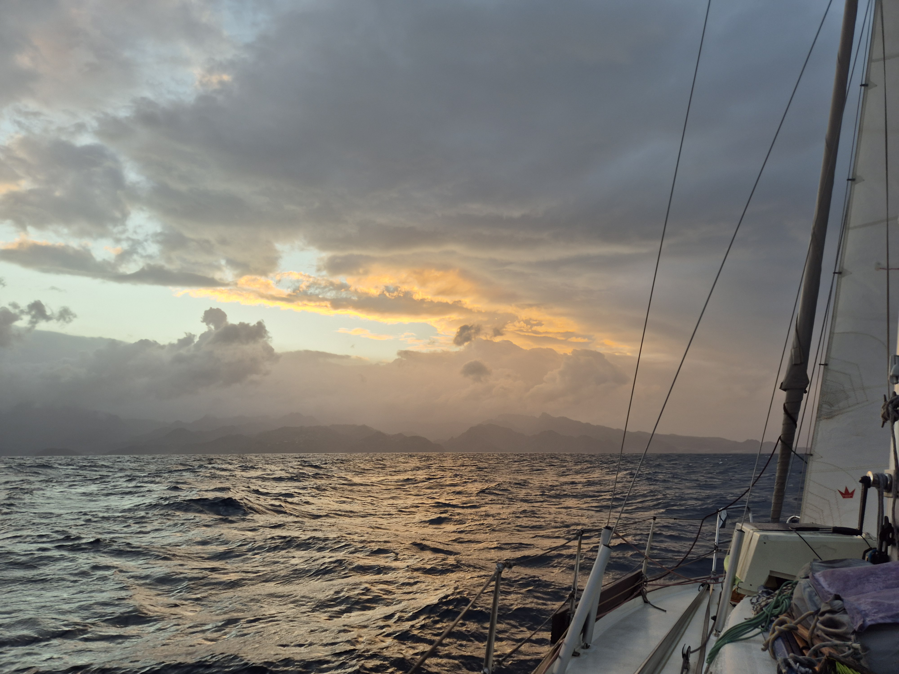
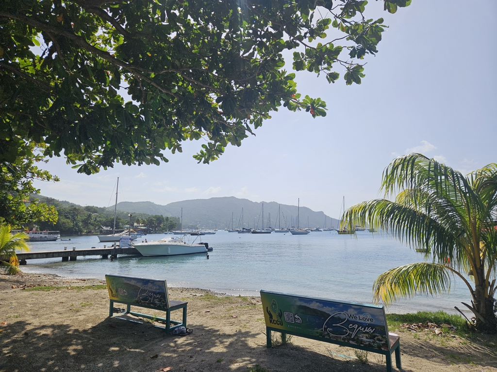

We spent a fun week in Sainte-Anne hanging out with fellow cruisers. Then Karin and Daniel flew in to sail with us. Once groceries delivery had arrived, we hoisted anchor and set sail for an overnighter south.

The seas were quite angry in the St. Lucia channel, and around Pitons we started getting hit by squalls of varying intensity. But with the second reef and staysail, things stayed manageable.

But sunrise we were abeam St. Vincent, and had to motor a bit. We dropped anchor in Bequia's Admiralty Bay at noon. Now it is time to check into the country and then enjoy all that these lovely islands have to offer.

* Distance today: 94NM
* Engine hours: 2.1
