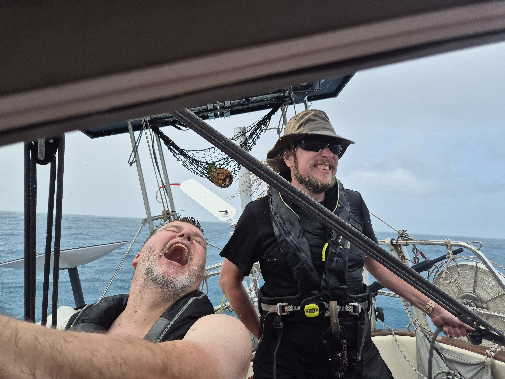
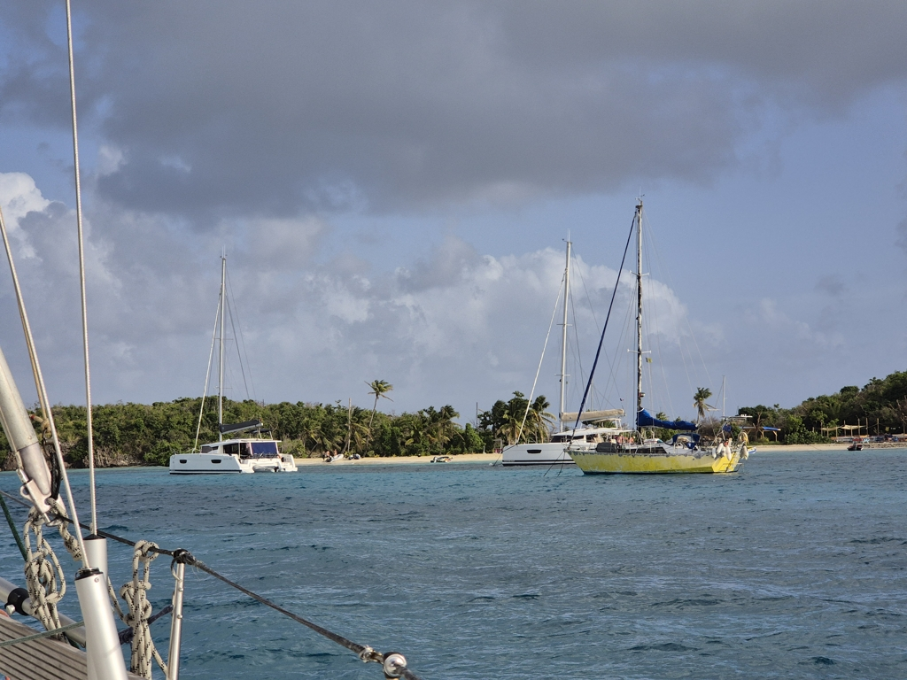

After our breakfast we hoisted sails and headed out. Destination Tobago Cays and its picture perfect palm beaches. As the squalls are a daily occurrence we left with staysail and first reef.

The day progressed with a nice beam reach and made good progress.  In the afternoon we had couple of squalls and went down to second reef. Some of us enjoyed the rain more than others.

Now we are anchored off Petit Bateau, the lobster dinner of tomorrow is already booked.  This is true Caribbean!

* Distance today: 26.2NM
* Lunch: feta salad
* Engine hours: 0.7
