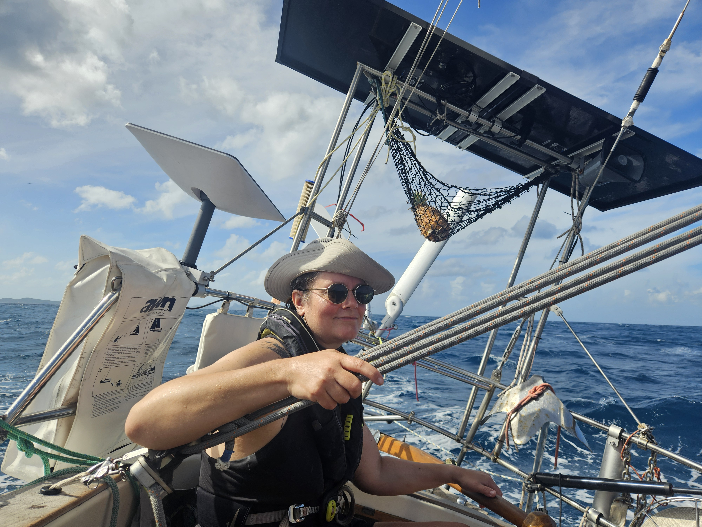
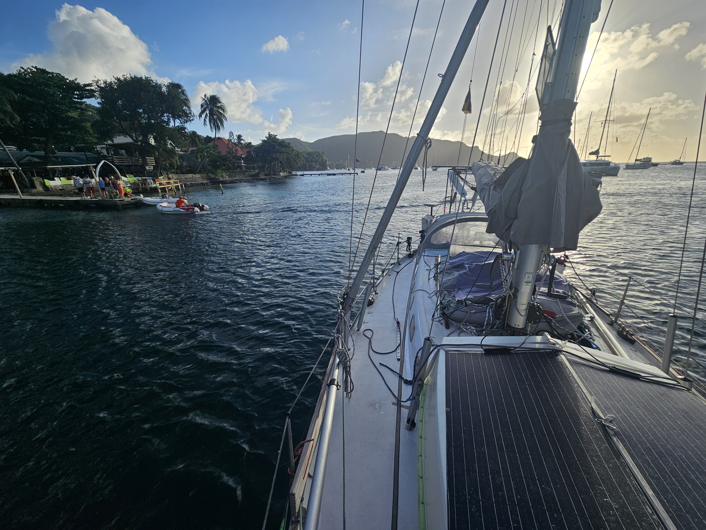

A perfect day was had in the paradise - swimming with sea turtles, flying kites, the tiki bar, and obviously the huge feast that was the lobster dinner!

In the morning we hoisted anchor and started the slow upwind slog back towards Martinique. Beautiful day, but quite splashy seas and adverse current made for slow progress.

As the ETA started drifting towards sunset, we decided to motorsail the rest of the way. We were greeted by one of the local "boat boys" and ended up picking a mooring right in front of the town dinghy dock. Literally 1.5 boat lengths away.

* Distance today: 28.9NM
* Lunch: aubergine curry
* Engine hours: 2.5
