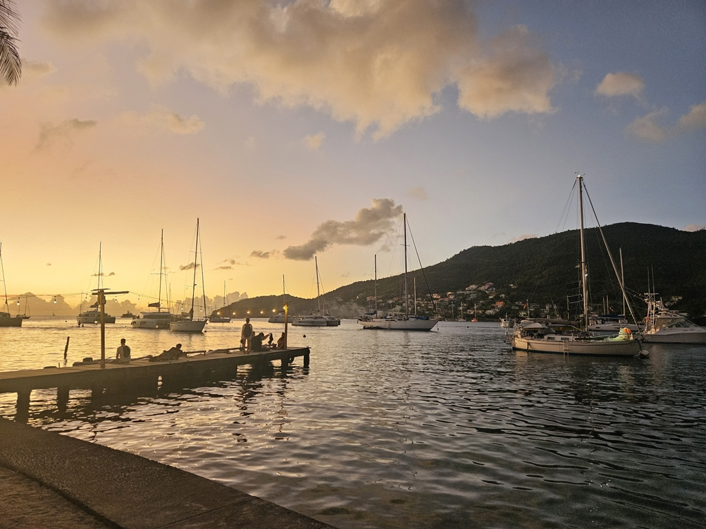
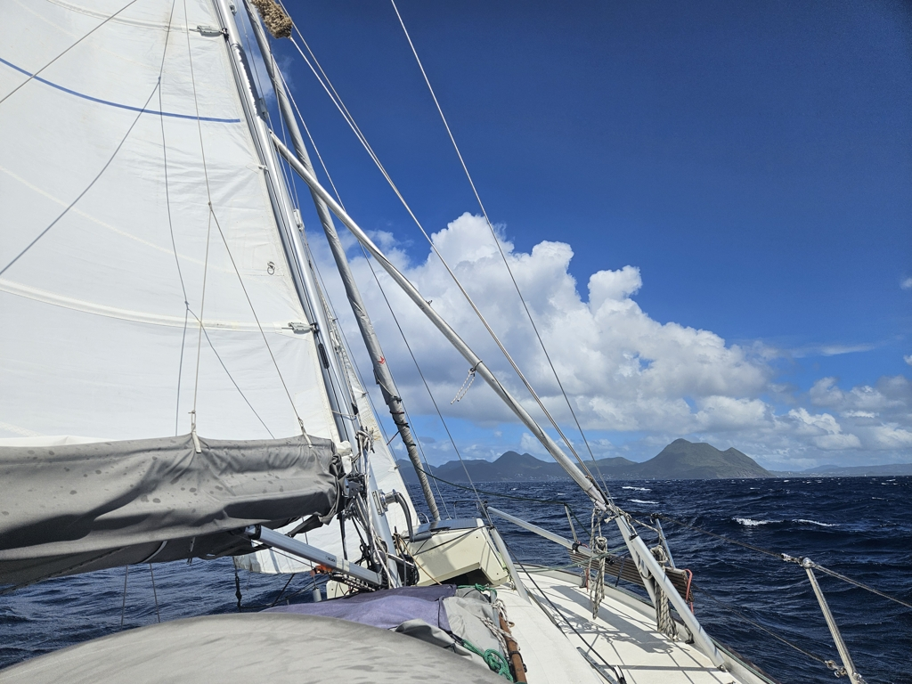

After enjoying a lovely day in Port Elisabeth we had a sturdy breakfast and let the mooring ball go. As we were motoring through the mooring field the wind kept picking up. First to 10kn, then to 15 and 20, so main in first reef and staysail went up. From there we started out standard 6 hour watches.

 

At sunset we found the lee of St Lucia, we kept sailing through it, even tacking once closer to shore. But eventually the lee got the best of us and we motored for an hour. As we were rounding the northernmost cape of St Lucia, the waves rolled in tall as mountains, dead on the nose. We sailed forward lurching and leaping over and through the waves, occasionally drenching the cockpit crew.

 

At dawn we found some shelter behind Martinique and could enjoy the unidirectional wave train. As we approached we joined the tens of sailboats buzzing around and could complete the Havel experience with wind twisting and turning  wind. Now we are in Anse Mitan where Karin and Daniel are going to leave us to join the next part of their Caribbean adventure.

* Distance today: 110NM
* Lunch: pancakes
* Engine hours: 2.7
