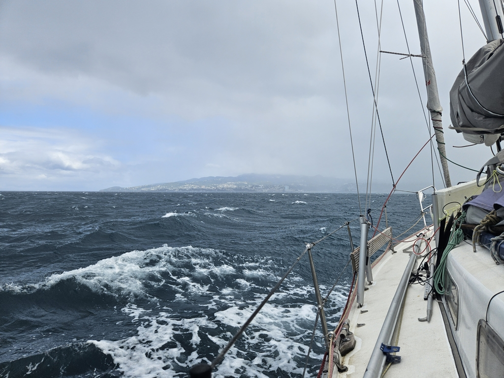
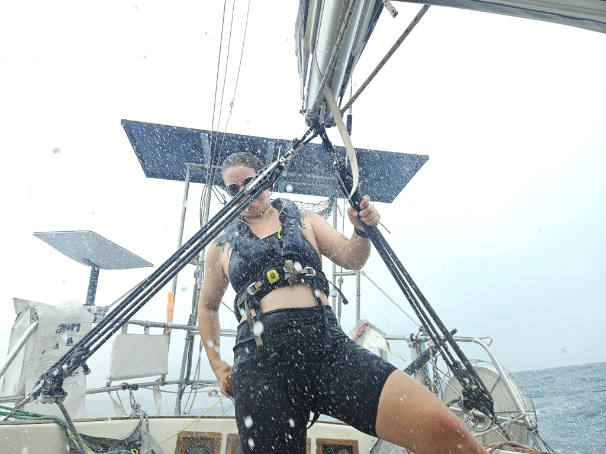

A fun week was had adventuring with and visiting some of our buddy boats. But now it's starting to be time to move on.

 

And so we hoisted anchor and motored over to Fort-de-France. One would think this is an easy 2.5NM across the bay, but with the acceleration zone, you need to prepare your boat to the sea. Accordingly we packed the dinghy and secured everything. And were happy to have done so, as we encountered a 34kt squall with quite splashy waves in the middle.

As we arrived to the anchorage, the tender from _Sya_ was waiting to guide us in, and to deliver some 3D-printed parts. Nice!

* Distance today: 3.1NM
* Engine hours: 1
